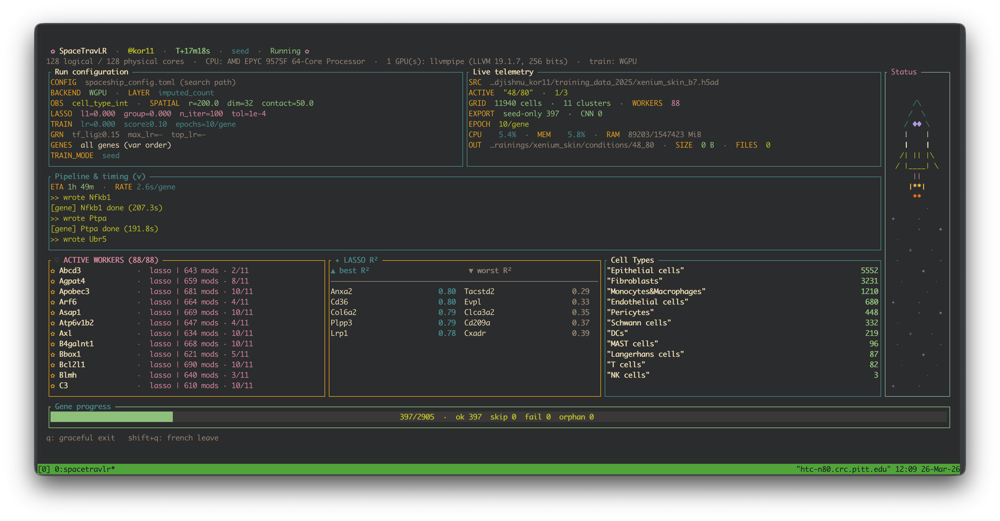

# SpaceTravLR (Rust 🦀️🚀️)

Rust implementation of [SpaceTravLR](https://github.com/jishnu-lab/SpaceTravLR)



## Installation

  Quick setup:

  ```bash
  echo 'export PATH="$PATH:/ix/djishnu/shared/djishnu_kor11/rust/SpaceTravLR_rust/bin"' >> ~/.bashrc
  echo 'export PATH="$PATH:/ihome/ylee/kor11/.cargo/bin"' >> ~/.bashrc
  source ~/.bashrc
  ```


  Or, compile it from scratch:

  ```bash
   module load rust
   export CARGO_HOME=/tmp/cargo # if you have disk quota issues
   ## then move the binary somewhere else after compilation
  ```

   Or install from source,

  ```bash
  curl --proto '=https' --tlsv1.2 -sSf https://sh.rustup.rs | sh
  rustup update stable
  rustc --version   # should be >= 1.85
  ```

### Install the training CLI (recommended)

From your machine:

```bash
git clone https://github.com/Koushul/SpaceTravLR_rust.git
cd SpaceTravLR_rust
```

Then install the **`spacetravlr`** binary into Cargo’s bin directory (usually `~/.cargo/bin`; ensure that directory is on your `PATH`):

```bash
# Full UI: Ratatui training dashboard (default features)
cargo install --path . --locked

# Leaner: faster compile, plain progress only (no dashboard dependencies)
cargo install --path . --locked --no-default-features
```

Confirm the install:

```bash
spacetravlr --help
```

| Install command | What you get |
|-----------------|----------------|
| `cargo install --path . --locked` | Dashboard when you run training without `--plain`; pass `--plain` for text-only progress. |
| `... --no-default-features` | Always plain progress (same as always using `--plain`); skips Ratatui, crossterm, and sysinfo. |


1. **Rust toolchain (1.85 or newer)** — this crate uses **edition 2024**. Install or update via [rustup](https://rustup.rs/):

2. **Compute backend** — the **`spacetravlr`** binary prefers **WGPU** when [wgpu](https://github.com/gfx-rs/wgpu) can acquire an adapter. If none is available, it uses Burn’s **NdArray (CPU)** backend. Set `SPACETRAVLR_FORCE_CPU=1` (or `true`) to force CPU.

3. **GRN parquet files** — training needs `mouse_network.parquet` and/or `human_network.parquet` (inferred from gene naming). Resolution order: `[grn].network_data_dir` in `spaceship_config.toml`, then the **`SPACETRAVLR_DATA_DIR`** environment variable (directory containing those files), then the crate’s `data/` from build metadata, then the executable’s `data/` or `../data/`, then walking up from the process current directory looking for `data/`, then `./data/` under cwd. You do **not** need to run the CLI from the repository root if one of these finds the files.


`cargo install` only installs **`spacetravlr`**. The legacy **`src/main.rs`** scratch binary is **not** installed; to run it from a clone: `cargo run --features dev-main --bin space_trav_lr_rust`.

### Build without installing

To compile in the repo without copying binaries to `~/.cargo/bin`:

```bash
cargo build --release
./target/release/spacetravlr --help
```

Or run directly:

```bash
cargo run --release -- --help
```

(`default-run` in `Cargo.toml` is `spacetravlr`, so you do not need `--bin` for that target.)

### Spatial + betadata web viewer (optional)

Interactive **deck.gl** UI for spatial coordinates from an `.h5ad` (`obsm["spatial"]`, then `X_spatial`, then `spatial_loc`) with coloring by **expression** (one gene from `X` or a layer), **betadata** (when a run TOML is supplied), or **cell type** when a standard `obs` cell-type column exists. Betadata is read from the **same directory as `spacetravlr_run_repro.toml`** (not a separate CLI path): **seed-only** models use a `Cluster` column (one β row per cluster; cells get values via `--cluster-annot`), while **spatial / full CNN** exports use `CellID` (per-cell β). `/api/meta` includes `betadata_row_id` (`Cluster` or `CellID`) when the first feather in that run directory can be probed.

Build the frontend once, then run the server:

```bash
cd web/spatial_viewer && npm install && npm run build && cd ../..
# Minimal: UI only — set .h5ad in the browser (serves `web/spatial_viewer/dist` by default)
cargo run --features spatial-viewer --bin spatial_viewer
# Or pass paths on the CLI:
cargo run --features spatial-viewer --bin spatial_viewer -- \
  --h5ad /path/to/data.h5ad \
  --network-dir /path/to/data \
  --bind 127.0.0.1 --port 8080
```

- **`--h5ad`**: optional; omit to open the app and load the file via **Dataset paths**.
- **`--layer`**: expression layer name (default **`imputed_count`**; empty in the UI defaults the same).
- **`--cluster-annot`**: obs column for cluster ids (default **`cell_type`**; empty in the UI defaults the same). Must exist in the `.h5ad` when you load.
- **`--network-dir`**: optional directory containing `{mouse|human}_network.parquet` for the **cell–cell context** panel (defaults to the same resolution order as training if omitted).
- **`--static-dir`**: directory for the built viewer (default **`web/spatial_viewer/dist`**, relative to the process working directory). Override if you built the frontend elsewhere.
- **`--run-toml`**: optional path to `spacetravlr_run_repro.toml` from the **same** SpaceTravLR run as your data (parent directory must contain `*_betadata.feather` files). `data.adata_path` in that file must resolve to the same dataset as **`--h5ad`**, and `n_obs` must match. When valid, `/api/meta` sets `perturb_ready` and `betadata_dir` to that run directory; the UI shows **Betadata** and **Perturbation (KO)** as color sources: gene, target expression (often `0` for KO), and scope (**all cells**, **current selection**, **one annotation cell type**, or **one cluster id** from `--cluster-annot`). **`POST /api/perturb/preview`** accepts JSON `{ "gene", "desired_expr", "scope": { "type": "all" | "indices" | "cell_type" | "cluster", ... } }` and returns little-endian `f32` Δ for the perturbed gene (length `n_obs`). If the dataset has **UMAP** in `obsm`, **`POST /api/perturb/umap-field`** runs the same perturbation, then a Rust port of velocyto **colΔCor** / **colΔCorpartial** (KNN on UMAP) plus SpaceTravLR-style transition probabilities, UMAP projection, and grid smoothing; JSON includes `grid_x`, `grid_y`, `u`, `v` (flattened `nx×ny`) for quiver overlays in the viewer (up to **40k** cells per request). Optional: `include_cell_vectors`, `n_neighbors`, `temperature`, `remove_null`, `unit_directions`, `grid_scale`, `vector_scale`, `delta_rescale`, `magnitude_threshold`, `use_full_graph`, `full_graph_max_cells`.

The viewer keeps a slim **chrome strip** (selection stats + a **color bar** with numeric ends when a continuous channel is loaded). **Hide controls** collapses the main toolbar; **Cell types** and **GRN / neighbor context** are collapsible `<details>` sections so the plot can use most of the window.

**Dataset paths** (expand **Dataset paths** in the toolbar) let you point the running server at a different `.h5ad`, expression layer, cluster column, optional GRN directory, and optional `spacetravlr_run_repro.toml` (betadata is inferred from the TOML’s directory when set) without restarting. Paths are resolved on the **machine running `spatial_viewer`** (use absolute paths or `~` as on the CLI). **`POST /api/session/configure`** accepts JSON `{ "adata_path", "layer"?, "cluster_annot"?, "network_dir"?, "run_toml"? }`; omitted or blank **`layer`** defaults to **`imputed_count`**, blank **`cluster_annot`** to **`cell_type`**. Returns `{ "ok", "message", "meta" }` with the same shape as **`GET /api/meta`** (including **`dataset_ready`**). Do not expose this endpoint on untrusted networks without authentication, since it allows reading arbitrary paths the server can access.

If `obsm['X_umap']` or `obsm['umap']` exists with the same `n_obs` and at least two columns, the UI shows a **Layout** control to switch the scatter plot between **Spatial** (the same key as training: `spatial` / `X_spatial` / `spatial_loc`) and **UMAP**. Neighbor discovery for the GRN interaction lens still uses **spatial** distances; only the plot coordinates change.

If `n_vars` is above 50k, the UI uses prefix search (`/api/genes?prefix=`) instead of loading the full gene list.

Betadata coloring uses **per-cluster** min/max (or symmetric range for the diverging map) so a single high cluster does not compress the rest of the tissue; clusters whose coefficients are all ~0 are shown in neutral gray. Cluster ids come from `GET /api/clusters` (same `obs` column as `--cluster-annot`).

If `obs` contains a cell-type column (same name resolution as the spatial estimator: `cell_type`, `cell_types`, `celltype`, `major_cell_type`, or case-insensitive `cell_type`), `/api/meta` includes `cell_type_column` and `cell_type_categories`, and `GET /api/cell_type/codes` returns little-endian `u16` category indices per cell (`65535` = unknown). The UI can color by cell type, show types on hover, and dim or exclude types from selection via per-type checkboxes.

The viewer loads the same **`{mouse|human}_network.parquet`** as training (via `--network-dir`, `SPACETRAVLR_DATA_DIR`, or the usual `data/` search). When loaded, `/api/meta` sets `network_loaded` and `network_species`. **`POST /api/network/cell-context`** (JSON: `cell_index`, `focus_gene`, optional `neighbor_k`, `neighbor_mode` (`"knn"` default or `"radius"`), `radius` when using radius mode, `tf_ligand_cutoff`, `expr_threshold`) returns GRN modulators for that target gene (TFs, ligands, LR pairs, NicheNet TF→ligand links), per-neighbor ligand–receptor support using the sender cell’s and neighbors’ expression, `support_score` (√(L·R)) on each edge, and optional `linked_tf` hints. The UI **Interaction lens** dims non-context cells, draws **strength-colored** segments to neighbors with supported L→R pairs, and lists neighbor-wise chains with expression bars. The interaction panel appears when a GRN is loaded (**kNN** or **radius** neighbor query). Remember **mean β** pools **per-cluster** rows in seed-only betadata vs **per-cell** for spatial CNN exports.

### Use as a Rust library

In your crate’s `Cargo.toml`:

```toml
[dependencies]
space_trav_lr_rust = { git = "https://github.com/Koushul/SpaceTravLR_rust.git" }
```

To depend on the library **without** the optional TUI stack (smaller dependency graph for library-only use):

```toml
space_trav_lr_rust = { git = "https://github.com/Koushul/SpaceTravLR_rust.git", default-features = false }
```

Then `use space_trav_lr_rust::...` as in this repository’s `src/lib.rs` exports.

## What SpaceTravLR does

SpaceTravLR learns how genes regulate each other across cells in a tissue, then simulates what happens when you knock out or overexpress a gene.

The core biological model: genes don't act in isolation. A transcription factor (TF) in cell A can regulate a target gene in cell A. But a ligand expressed by cell B can also regulate genes in nearby cell A — the signal decays with distance following a Gaussian kernel.

```
    Spatial tissue cross-section
    ─────────────────────────────────────────────

        Cell B (L=5)            Cell C (L=2)
        ┌──────┐               ┌──────┐
        │ligand│               │ligand│
        └──┬───┘               └───┬──┘
           │                       │
           │  Gaussian decay       │  Gaussian decay
           │  w = e^(-d²/2r²)      │  w = e^(-d²/2r²)
           │                       │
           ▼                       ▼
        ┌──────────────────────────────┐
        │           Cell A             │
        │                              │
        │  received_L = Σ w·L / N      │
        │            = (w_B·5 + w_C·2  │
        │               + w_A·0) / 3   │
        │                              │
        │  TF ──► target gene          │
        │  received_L ──► target gene  │
        │  (via beta coefficients)     │
        └──────────────────────────────┘
```

## Architecture


| Module | Description |
|---|---|
| `betadata` | `BetaFrame` / `Betabase` — load trained beta coefficients (CSV or Parquet), expand to cell level, run `splash()` |
| `perturb` | In-silico gene perturbation with spatial propagation (`perturb()`) |
| `ligand` | Gaussian-kernel weighted ligand computation (`calculate_weighted_ligands`) |
| `estimator` | Clustered group-lasso + optional CNN refinement (`ClusteredGCNNWR`) |
| `spatial_estimator` | End-to-end training pipeline with AnnData I/O (`fit_all_genes`) |
| `lasso` | FISTA-accelerated sparse group lasso solver |
| `network` | GRN loading (CellChat LR database, TF–target links) |
| `config` | TOML config (`spaceship_config.toml`) |
| `training_tui` | Full-screen training dashboard; **Run configuration** panel shows effective TOML/CLI parameters (optional `tui` feature) |

The **`spacetravlr`** executable (`src/bin/spacetravlr.rs`) is the only shipped training CLI: **clap**-parsed flags match whether you use the dashboard or `--plain`.

## Quick start

```bash
# Train (seed-only lasso, 4 workers, line-oriented logs)
cargo run --release -- --plain \
  --parallel 4 --max-genes 50 --output-dir /tmp/betas

# Same flags with full-screen dashboard (default when built with `tui` feature)
cargo run --release -- \
  --parallel 4 --max-genes 50 --output-dir /tmp/betas

# Full CNN mode
cargo run --release -- --plain \
  --training-mode full --epochs 5 --parallel 2 --max-genes 20
```

See `cargo run --release -- --help` (or `spacetravlr --help` after install). Options are defined with **clap**; config file path is `-c` / `--config`, dataset override is `--h5ad`.


## Export CNN Weights (Compressed) + PyTorch Loading

Enable model export in `spaceship_config.toml`:

```toml
[model_export]
save_cnn_weights = true
compressed_npz = true
output_subdir = "saved_models"
```

When a gene runs per-cell CNN refinement, SpaceTravLR writes compressed `.npz` files to:
`<execution.output_dir>/saved_models/<gene>_cnn_weights.npz`

Use the provided Python example to load exported weights into an equivalent PyTorch model:

```bash
python scripts/load_cnn_npz_pytorch.py \
  --npz /tmp/slideseq_brain/saved_models/MY_GENE_cnn_weights.npz \
  --cluster 0
```

## HTML run summary

After training (or anytime you have an `.h5ad` and output directory), emit a small browser report (styled via embedded CSS, same layout tokens as the SpaceTravLR run-summary template):

```bash
cargo run --release --bin spacetravlr -- run-summary \
  --h5ad /path/to/dataset.h5ad \
  --output-dir /tmp/training \
  -c spaceship_config.toml
```

Paths default from `spaceship_config.toml` when `--h5ad` / `--output-dir` are omitted. Optional `--manifest` merges training JSON fields when present.

Writes `spacetravlr_run_summary.html` only (AnnData shape, cluster counts, detected spatial key, optional manifest/config fields). No figure generation.

---

## Optimization philosophy

Four principles recur across the performance-critical paths (`splash`, `perturb`, `calculate_weighted_ligands`):

### 1. Cache-first data layout

The dominant cost in spatial transcriptomics is iterating over cells (N = 1k–100k). Every hot loop is structured so that the innermost iteration stays within a single cache line or L1-resident slice:

```
  Row-major layout: cells × genes
  ════════════════════════════════

  Memory: [cell0_g0, cell0_g1, cell0_g2, ..., cell1_g0, cell1_g1, ...]
           ├──── cell 0 row (~2KB) ────┤├──── cell 1 row (~2KB) ────┤

  ✓ Row-oriented (our approach)       ✗ Column-oriented (naive)
  for cell in 0..N:                   for gene in 0..G:
      for gene in 0..G:                  for cell in 0..N:
          data[cell * G + gene]  ◄──          data[cell * G + gene]  ◄──
              sequential reads                    stride = G×8 bytes
              same cache line                     cache miss every access

  │ Memory access pattern:            │ Memory access pattern:
  │ ████████░░░░░░░░ cell 0           │ █░░░░░░░█░░░░░░░ gene 0
  │ ░░░░░░░░████████ cell 1           │ ░█░░░░░░░█░░░░░░ gene 1
  │ sequential, cache-friendly        │ strided, cache-hostile
```

- **Row-oriented traversal**: "for each cell, process all modulators" instead of "for each modulator, iterate all cells." A cell's result row is ~2KB — fits in L1. The column-major alternative would stride across hundreds of KB per write.
- **Flat contiguous arrays**: All matrices are stored as `Vec<f64>` in row-major order. Reading `flat[i * ncols + col]` for multiple columns within the same cell hits the same cache lines.

### 2. Zero-allocation direct access

The naive Python approach creates a new DataFrame or temporary array for each gene/cell/iteration. In Rust, column indices are resolved at setup time into integer offsets, and the hot loop reads directly from the flat backing arrays:

```rust
struct LrWork {
    beta_col: usize,   // index into lr_betas flat array
    rec_oi:   usize,   // output column for receptor
    wl_col:   usize,   // column in rw_ligands.data
    gex_col:  usize,   // column in gex_df.data
}

// Hot loop: no strings, no HashMap lookup, no allocation
let wl = rw_flat[i * rw_ncols + lw.wl_col];
let gex = gex_flat[i * gex_ncols + lw.gex_col];
```

This pattern is used in `splash()`, `perturb_all_cells()`, and `calculate_weighted_ligands()`.

### 3. Rayon parallelism

Every cell-level computation is embarrassingly parallel. The shared read-only data (beta arrays, input matrices, work item lists) requires no synchronization:

```rust
result.par_chunks_mut(n_out)   // each chunk = one cell's result row
    .enumerate()
    .for_each(|(i, r)| { /* per-cell body */ });
```

On an M3 Max with 12 performance cores this gives near-linear scaling. The parallel granularity is always per-cell (not per-gene), because the per-cell working set fits in L1 while the per-gene working set spans the entire cell array.

### 4. Unchecked indexing in validated loops

All array indices are validated during setup (column names resolved, cell-to-cluster mapping bounds-checked). The hot loops use `get_unchecked` to eliminate per-access bounds checks, which removes compare-and-branch instructions that otherwise prevent SIMD vectorization:

```rust
unsafe {
    *r.get_unchecked_mut(lw.rec_oi) += beta * wl * scale_factor;
}
```

---

## Splash: partial derivative computation

`splash()` computes the partial derivative of each target gene's expression with respect to every modulator gene — how much does the target change if we nudge each modulator?

```
  Three signaling mechanisms, five derivative terms
  ═══════════════════════════════════════════════════

  1. Transcription Factor (TF)          2. Ligand–Receptor (LR)
  ┌─────────┐                           ┌─────────┐
  │  TF gene│                           │  Ligand │ (nearby cell)
  └────┬────┘                           └────┬────┘
       │                                     │ Gaussian
       │ β_TF                                │ kernel
       │                                     ▼
       │                                ┌─────────┐    β_LR
       │                                │Received │────────┐
       │                                │ ligand  │        │
       │                                └─────────┘        │
       │                                ┌─────────┐        │
       │                                │Receptor │ ◄──────┘
       │                                │  gene   │  (if expressed)
       │                                └────┬────┘
       ▼                                     ▼
  ┌──────────────────────────────────────────────┐
  │              Target gene expression          │
  └──────────────────────────────────────────────┘
       ▲
       │
  ┌────┴────┐
  │TF-Ligand│  3. TF-Ligand (TFL)
  │  pair   │     β_TFL × regulator_expression
  └─────────┘     β_TFL × received_ligand
```

Given trained beta coefficients, the derivatives decompose into five terms:

| Derivative | Formula | Applies to |
|---|---|---|
| dy/dTF | beta_TF | Transcription factors |
| dy/dR | beta_LR \* wL (where gex\[R\] > 0) | Receptors in LR pairs |
| dy/dL (LR) | beta_LR \* gex\[R\] | Ligands in LR pairs |
| dy/dL (TFL) | beta_TFL \* gex\[regulator\] | Ligands in TF-ligand pairs |
| dy/dTF (TFL) | beta_TFL \* wL_tfl | Regulators in TF-ligand pairs |

Where `wL` is the spatially weighted ligand signal (Gaussian kernel over cell coordinates), `gex` is gene expression, and `beta_*` are the trained coefficients. The LR and TFL terms are scaled by `scale_factor` and optionally clamped by `beta_cap`.

The output is a (cells x modulator_genes) matrix where multiple LR/TFL pairs contributing to the same gene are summed. This matrix drives the perturbation simulation loop.

### Splash benchmark — Python vs Rust

Both implementations compute `splash()` on 50 trained genes with uniform mock expression data. Numerical equivalence confirmed to <1e-15 max absolute difference across 121,220 values.

| Cells | Python (ms) | Rust (ms) | Speedup |
|------:|------------:|----------:|--------:|
| 100 | 66.7 | 4.8 | **13.9x** |
| 1,000 | 123.1 | 6.4 | **19.2x** |
| 10,000 | 743.4 | 38.2 | **19.5x** |
| 50,000 | 3,778.6 | 171.1 | **22.1x** |
| 100,000 | 10,882.6 | 336.1 | **32.4x** |

*Apple M3 Max, `--release` for Rust, Python 3.12 + NumPy/Pandas. 50 genes, 13 clusters, 423 unique modulator genes, up to 261 modulators per gene.*

### Why splash scales so well

The speedup *increases* with cell count (13.9x at 100 cells to 32.4x at 100k). This is the opposite of what you'd expect if both implementations were memory-bandwidth-bound. The explanation is the per-cell working set:

- **Rust**: each cell's result row (~2KB), beta arrays (~20KB for 13 clusters), and input matrix rows (~3KB each) all fit in L1/L2 cache. The inner loop is pure arithmetic on cached data. As N grows, the ratio of useful computation to cache-miss overhead improves.
- **Python**: each `BetaFrame.splash()` call creates multiple intermediate DataFrames (`.multiply()`, `.where()`, `.sum()`). For 50 genes with ~160 LR pairs, this creates hundreds of temporary arrays per call. At 100k cells these temporaries are ~12MB each, blowing through L3 cache. Python's overhead is proportional to N × (number of temporaries), while Rust's overhead is essentially fixed per cell.

At 100k cells, Rust processes all 50 genes in 336ms — that's 67 microseconds per gene, or **0.67 nanoseconds per cell per gene**. At this throughput the bottleneck is memory bandwidth for streaming through the input matrices, not compute.

### How the optimized splash works

The implementation (`betadata.rs: BetaFrame::splash()`) applies all four optimization principles:

**Setup phase** (runs once per splash call, ~microseconds):
- Resolve all gene names to column indices in rw_ligands, rw_ligands_tfl, and gex_df
- Build `LrWork` and `TflWork` structs with pre-resolved flat indices
- Get flat `&[f64]` slices of all input matrices and beta arrays

**Hot loop** (runs N × n_modulators times):
```
for each cell i (parallel via rayon par_chunks_mut):
    br = cell_to_beta_row[i]         // cluster → beta row (1 lookup)
    for each TF j:                   // ~20 iterations
        r[tf_oi[j]] += tf_betas[br * n_tfs + j]
    for each LR pair:                // ~160 iterations
        beta = lr_betas[br * n_lr + col]
        wl   = rw_flat[i * ncols + wl_col]
        gex  = gex_flat[i * ncols + gex_col]
        if gex > 0: r[rec_oi] += beta * wl * scale
        r[lig_oi] += beta * gex * scale
    for each TFL pair:               // ~80 iterations
        // similar pattern
```

The key insight is that `br` (beta row) is the same for all modulators within a cell, so the beta array access pattern is a tight sequential scan through a ~1KB slice that stays pinned in L1.

---

## Weighted ligands: Gaussian kernel spatial averaging

`calculate_weighted_ligands()` computes the amount of each ligand received by each cell, weighted by a Gaussian kernel over pairwise distances:

```
received[i, l] = (1/N) Σ_j scale · exp(-d(i,j)² / 2r²) · expression[j, l]
```

This is O(N² × L) where N = cells and L = ligands per radius group. Two implementations are available:

**Exact** (`calculate_weighted_ligands`): Fuses the Gaussian kernel with the weighted sum in a single pass, computing `exp(-d²/2r²)` on the fly and immediately multiplying by ligand values. No N×N matrix is materialized. Working set per target cell: result row (L × 8 bytes) + streaming through the ligand matrix.

**Grid-approximated** (`calculate_weighted_ligands_grid`): Evaluates the Gaussian convolution at A grid anchor points (O(A × N × L)), then bilinearly interpolates to each cell (O(N × L)). Since A depends on spatial extent, not cell count, this reduces the quadratic bottleneck to near-linear scaling. See "Optimization attempts for received ligands" for the full analysis.

---

## Perturb: in-silico gene perturbation

`perturb()` simulates knocking out or overexpressing a gene and propagates the effect through the spatial gene regulatory network. It mirrors Python's `GeneFactory.perturb()`.

### What it does


Each propagation iteration:

1. **Splash all genes** — compute dy/dx derivatives for every trained gene using current expression and received ligands
2. **Update expression** — apply current delta to get new gene expression matrix
3. **Recompute received ligands** — Gaussian-kernel spatial averaging of ligand expression at each cell location (O(N² × L) per radius group)
4. **Delta swap** — replace direct ligand expression changes with spatially-received ligand changes
5. **Apply perturbation** — for each trained gene g: `delta[g] = Σ_k splash[g,k] · delta[modulator_k]`
6. **Enforce & clip** — pin target genes to desired expression, clamp all genes to observed range

### Why "delta swap" matters

The trained model predicts gene expression as a function of *received* ligand signals (weighted by spatial proximity), not direct ligand expression. When a perturbation changes a ligand gene's expression at cell A, the downstream effect at cell B depends on how much of that ligand B *receives* (Gaussian-weighted by distance).

```
  Without delta swap (WRONG)         With delta swap (CORRECT)
  ──────────────────────────         ────────────────────────────

  Cell A: ΔL = -5                    Cell A: ΔL = -5
      │                                  │
      │ directly applied                 │ Gaussian kernel
      ▼                                  ▼
  Cell A: model sees ΔL = -5        Cell B (near):  Δ_received = -4.2
  Cell B: model sees ΔL =  0        Cell C (mid):   Δ_received = -1.8
  Cell C: model sees ΔL =  0        Cell D (far):   Δ_received = -0.1
                                     Cell A:         Δ_received = -5.0
  ✗ Ligand effect is                 ✓ Ligand effect spreads
    purely cell-autonomous             spatially through tissue
```

The delta swap step replaces direct ligand deltas with received-ligand deltas:
```
delta_simulated += delta_rw_ligands - delta_direct_ligands
```

This ensures that ligand effects propagate spatially through the Gaussian kernel rather than being applied cell-autonomously.

### Perturb benchmark — Python vs Rust (exact) vs Rust (grid approximation)

All implementations perturb a single gene (knockout) across 50 trained genes with 3 propagation steps. Exact mode confirmed numerically equivalent to Python (<2e-15 max diff).

| Cells | Python (ms) | Rust exact (ms) | Rust grid (ms) | Grid vs Python |
|------:|------------:|-----------------:|---------------:|---------------:|
| 200 | 232 | 18 | 16 | **14.6x** |
| 500 | 297 | 40 | 23 | **13.2x** |
| 1,000 | 434 | 120 | 37 | **11.7x** |
| 2,000 | 808 | 311 | 64 | **12.7x** |
| 5,000 | 2,030 | 1,774 | 159 | **12.7x** |
| 10,000 | 5,473 | 7,137 | 384 | **14.3x** |

*Apple M3 Max, `--release` for Rust, Python 3.12 + NumPy/Pandas. 50 genes, 468 total genes, 3 propagation steps, grid_factor=0.5.*

### The O(N²) problem and the grid solution

Without approximation, the received ligands step is O(N² × L) — pairwise Gaussian kernel over all cells. At 10,000 cells, exact Rust (7.1s) was actually **slower than Python** (5.5s) because both execute the same SIMD `exp()` intrinsics, but Python's NumPy dispatches the entire N×N kernel as a single vectorized operation while Rust's row-parallel approach has more loop overhead at this scale.

The grid approximation eliminates the O(N²) bottleneck entirely. The key insight: the received ligand function `R(x) = (1/N) Σ_j K(x, x_j) · expr_j` is a Gaussian convolution — a smooth function of position. Cells that are spatially close receive nearly identical ligand signals.

```
  Exact: O(N²)                     Grid approx: O(A·N)
  ════════════════                  ═══════════════════════

  Every cell talks to               Anchor grid over tissue
  every other cell:                  (spacing = r × factor):

  ● ● ● ● ● ●                      ╋━━━━━╋━━━━━╋
  ● ● ● ● ● ●                      ┃ ●  ●┃● ●  ┃
  ● ● ● ● ● ●                      ┃●   ●┃  ● ●┃
  ● ● ● ● ● ●                      ╋━━━━━╋━━━━━╋
  ● ● ● ● ● ●                      ┃●● ● ┃ ●●  ┃
  ● ● ● ● ● ●                      ┃ ●  ●┃●  ● ┃
                                     ╋━━━━━╋━━━━━╋
  N×N pairs = 36×36                    ╋ = anchor (A=9)
  = 1296 kernel evals                  ● = cell (N=36)

                                     Step 1: A×N = 9×36 = 324 evals
                                     Step 2: interpolate → N cells
                                     Total: 324 vs 1296 = 4x fewer

  At N=10000, A≈100:
  Exact:  10000² = 100M evals
  Grid:   100×10000 = 1M evals → 100x fewer
```

**How it works:**

1. Place anchor points on a regular grid with spacing = `radius × grid_factor`
2. Compute exact received ligands at each anchor by summing over all N cells: O(A × N × L)
3. For each cell, bilinearly interpolate from the 4 surrounding grid anchors: O(N × L)

```
  Bilinear interpolation for a single cell
  ─────────────────────────────────────────

     a00 ──────────── a10          a_ij = anchor values
      │  ╲      tx     │           tx, ty = fractional position
      │    ╲           │              within the grid cell
      │ ty  ╲          │
      │       ● cell   │           value = a00·(1-tx)(1-ty)
      │                │                 + a10·(tx)(1-ty)
      │                │                 + a01·(1-tx)(ty)
     a01 ──────────── a11                + a11·(tx)(ty)
```

Total: O(A × N × L) instead of O(N² × L), where A = grid anchor count.

A depends on the spatial extent of the tissue, not the number of cells. For a 1000×1000 area with radius=200 and grid_factor=0.5, A ≈ (1000/100)² = 100 anchors. So at 10,000 cells the reduction is 10,000/100 = **100x fewer kernel evaluations**. The actual observed speedup is 18.6x (grid vs exact) because the anchor computation and interpolation have overhead.

### Grid approximation accuracy

The interpolation error for bilinear interpolation on a Gaussian-smoothed field is O(h²/r²) where h = grid spacing. With grid_factor = 0.5: relative error ≈ 1/32 ≈ 3%.

| Cells | Max abs error | Mean abs error |
|------:|--------------:|---------------:|
| 200 | 3.50e-1 | 3.60e-4 |
| 500 | 2.80e-1 | 3.17e-4 |
| 1,000 | 2.35e-1 | 2.39e-4 |
| 2,000 | 1.58e-1 | 1.04e-4 |
| 5,000 | 4.64e-2 | 4.15e-5 |
| 10,000 | 1.75e-2 | 1.25e-5 |

Max absolute error decreases with N because denser cells mean finer spatial coverage and more grid anchors. Mean error is tiny across all scales (< 1e-3). At the biologically relevant scales of 5,000+ cells, max error is < 5% of typical gene expression values — well within the modeling uncertainty of the Gaussian kernel itself.

### Why the speedup is now consistent

With the grid approximation, the speedup vs Python stays at 11–15x across all cell counts, instead of degrading from 13x to 1.2x. This is because the grid reduces the dominant O(N²) step to O(A × N), making the splash and perturb_all_cells steps (where Rust has a large advantage) the dominant cost again at every scale.

### How perturb_all_cells works

For each trained gene, splash produces a (cells × modulators) matrix of derivatives. `perturb_all_cells` multiplies these by the current delta vector to propagate effects:

```
for each cell i (parallel via rayon):
    for each trained gene g:
        gene_idx = gene_to_index[g]
        result[i][gene_idx] = Σ_k splash_g[i][k] · delta[i][mod_idx[k]]
```

This is parallelized cell-by-cell (not gene-by-gene) to keep the working set in L1. Each cell reads its splash rows across all genes (~50 × 200 × 8 = 80KB, fits in L2) and writes to a single result row (~4KB, fits in L1). The modulator-gene index mapping is pre-resolved at setup time so the inner loop is a pure dot product with scatter-gather indexing.

---

## Optimization attempts for received ligands

Three approaches were tried for the received ligands computation. Two failed, one succeeded:

### Attempt 1: Precomputed N×N weight matrix (FAILED — 2.6x slower)

Precompute the N×N Gaussian weight matrix once (per unique radius) and reuse across all 3 propagation iterations, avoiding redundant `exp()` calls:

```
// Attempted approach:
W = compute_weight_matrix(xy, radius)   // N×N, O(N²)
for iter in 0..3:
    received = W × ligand_matrix        // O(N² × L), but W is precomputed
```

**Result: 2.6x slower at 5000 cells** (4517ms vs 1722ms for the fused approach).

```
  Why precomputed W fails at scale
  ═════════════════════════════════

  N=5000 weight matrix: 5000 × 5000 × 8 bytes = 200MB

  Cache hierarchy (M3 Max):
  ┌────────────────────────────────────────────────────┐
  │ L1:  192KB  │████│                                 │
  │ L2:  32MB   │████████████████│                     │
  │ L3:  36MB   │█████████████████│                    │
  │ Weight mat: │█████████████████████████████████████ │ 200MB
  └────────────────────────────────────────────────────┘
                 ↑ matrix doesn't fit in any cache level

  Fused approach:                 Precomputed approach:
  ┌─────────┐                    ┌──────────────────────┐
  │ src row │ 400B  ─┐           │                      │
  │ dst acc │ 400B  ─┤ 800B     │  200MB weight matrix │ cache
  └─────────┘        │ in L1    │  streamed per ligand │ thrash
                     ▼           │  × 3 iterations     │
               compute exp()    │  = ~30GB bandwidth   │
               once, use,       └──────────────────────┘
               discard
```

**Why it failed**: The N×N weight matrix for 5000 cells is 5000² × 8 = **200MB**. This exceeds L3 cache (36MB on M3 Max). The matrix multiply `W × ligand_matrix` must stream through 200MB of weights for each of the L ligand columns, causing massive cache thrashing. The total memory bandwidth consumed is 200MB × L × 3 iterations = ~30GB.

The fused approach avoids this entirely. For each target cell i, it computes `exp(-d²/2r²)` on the fly and immediately multiplies by the ligand value. The weight is used once and discarded — it never needs to be stored. The only data that needs to be in cache is the current source cell's ligand row (~400 bytes) and the target cell's accumulator row (~400 bytes). Total working set: ~800 bytes vs 200MB.

**Lesson**: Precomputation only helps when the precomputed result fits in cache. At O(N²) storage, the weight matrix approach has a crossover point around N ≈ 2000 cells (where N² × 8 ≈ 32MB ≈ L3 cache size). Above that, the memory bandwidth cost of reading the precomputed matrix exceeds the compute cost of recalculating `exp()`.

### Attempt 2: Fused kernel (baseline — fastest exact approach)

Compute the Gaussian weight and immediately multiply by ligand values, discarding the weight after use:

```rust
for j in 0..n_cells {
    let w = scale * (d2 * inv_2r2).exp();
    for k in 0..n_ligands {
        row[k] += w * lig[j][k];
    }
}
```

Working set per target cell: result row (L × 8 bytes) + streaming through ligand matrix (N × L × 8 bytes). This is the fastest exact approach — no N×N storage, good cache behavior. But still O(N²) total work.

### Attempt 3: Grid anchor + bilinear interpolation (SUCCESS — 11–19x faster)

The winning approach exploits the smoothness of the Gaussian convolution. Instead of evaluating at all N cell locations, evaluate at A grid anchor points and interpolate:

```
Step 1: Place anchors on grid (spacing = r × 0.5)     → A anchors
Step 2: Exact sum at each anchor over all N cells      → O(A × N × L)
Step 3: Bilinear interpolation for each cell           → O(N × L)
```

The anchor grid has A = (spatial_extent / spacing)² nodes, determined by tissue geometry, not cell count. For a 1000×1000 tissue with r=200: A ≈ 100. At 10,000 cells this is a 100x reduction in kernel evaluations.

The bilinear interpolation introduces O(h²/r²) ≈ 3% relative error (at grid_factor=0.5), decreasing with cell density. This is well within the modeling uncertainty — the Gaussian kernel itself is a simplification of real cell-cell communication.

---

## Training pipeline: sparse group lasso via FISTA

The training side (`lasso/` module) implements a sparse group lasso solver using FISTA (Fast Iterative Shrinkage-Thresholding Algorithm).

### Mathematical formulation

Minimise over **w**:

```
(1/2n) · ‖Xw − y‖² + Σ_g reg_g · ‖w_g‖₂ + l1_reg · ‖w‖₁
```

where the groups are disjoint subsets of features (TFs, LR pairs, TFL pairs). The L2 group penalty encourages entire groups to be zeroed out (group sparsity), while the L1 penalty encourages individual feature sparsity within active groups.

```
  Sparse Group Lasso: two levels of sparsity
  ═══════════════════════════════════════════

  Features:  [TF1 TF2 TF3 | LR1 LR2 LR3 LR4 | TFL1 TFL2]
              ╰── group 1 ─╯╰──── group 2 ────╯╰─ group 3 ╯

  L2 group penalty (‖w_g‖₂):        L1 penalty (‖w‖₁):
  Entire groups → zero               Individual features → zero

  Before:  [0.3 0.1 0.2 | 0.4 0.05 0.3 0.02 | 0.01 0.008]
  After:   [0.2 0.0 0.1 | 0.3 0.0  0.2 0.0  |  0    0   ]
             ╰── active ─╯╰──── active ──────╯╰── zeroed ─╯
                  sparse          sparse          group
                  within          within          killed
```

### FISTA implementation

The solver (`lasso/fista.rs`) implements Beck & Teboulle (2009) with two enhancements:

- **Adaptive restart** (O'Donoghue & Candès 2012): When the generalized gradient inner-product with the update direction exceeds the smooth loss, Nesterov momentum is reset to 1. This prevents oscillation near the optimum.
- **Backtracking line search**: The Lipschitz constant is doubled until the quadratic upper bound is satisfied (eq. 2.5 in Beck & Teboulle). This removes the need to know the Lipschitz constant a priori.

The initial Lipschitz estimate comes from power iteration on X^T X (randomized, optionally subsampled), implemented in `lasso/singular_values.rs`.

### Proximal operators

The composite proximal operator for sparse group lasso applies L1 soft-thresholding first, then group L2 block shrinkage:

```
prox(w) = group_l2_prox(l1_prox(w, λ₁/L), {reg_g/L})
```

The L2 proximal operator shrinks entire group blocks toward zero while preserving their direction:

```
prox_l2(w_g, reg) = w_g · max(0, 1 - reg/‖w_g‖₂)
```

### Per-cluster training

`ClusteredGCNNWR` fits an independent lasso model per cell-type cluster. In seed-only mode, each cluster gets its own set of beta coefficients. In full CNN mode, the lasso coefficients serve as anchor points for a spatial CNN that produces per-cell betas.

```
  Seed-only mode: betas per cluster
  ═══════════════════════════════════

  Tissue with 3 clusters:                  Beta storage:
  ┌──────────────────────┐                 ┌──────────────────┐
  │  ○ ○    △ △          │                 │ Cluster │ β_TF1  │
  │    ○  □ □  △         │ ──train──►      │    0 (○) │  0.42  │
  │  ○  □ □    △ △       │  per cluster    │    1 (□) │  0.31  │
  │    □ □   △           │                 │    2 (△) │  0.18  │
  └──────────────────────┘                 └──────────────────┘

  At inference: cell → cluster → beta row
                (many-to-one mapping, shared via Arc)
```

The `fit_all_genes` pipeline trains all genes in parallel using a shared work queue with file-based locking for multi-process coordination:


- **Arc sharing**: Coordinates, cluster assignments, and the GRN are loaded once and shared across all worker threads via `Arc`
- **Lock files**: Each gene creates a `.lock` file during training, allowing multiple processes to train different genes concurrently without duplication
- **Incremental**: Already-trained genes (existing `_betadata.csv`) are skipped automatically

---

## Betabase: efficient beta storage

`Betabase` loads all `*_betadata.{csv,parquet}` files from a directory in parallel (via rayon), then expands every frame to cell level.

```
  Betabase loading pipeline
  ═════════════════════════

  /tmp/betas/
  ├── GeneA_betadata.csv ──┐
  ├── GeneB_betadata.csv ──┤ parallel
  ├── GeneC_betadata.csv ──┤ (rayon)     ┌─────────────┐
  ├── ...                  ├──────────►  │  Betabase    │
  └── GeneN_betadata.csv ──┘             │  Vec<Beta-   │
                                         │    Frame>    │
  cell_labels: [C0, C1, ...]             │             │
  cluster_map: {C0→0, C1→2, ...}         │ + Arc<cell  │
       │                                  │   mapping>  │
       └──────────────────────────────►  │             │
                                         │ + gene2index│
  gene2index: {"TP53"→42, ...}           │   resolved  │
       │                                  └─────────────┘
       └──────────────────────────────►
         pre-resolve names → integers for hot loop
```

### Cell mapping with Arc sharing

For seed-only models, betas are stored per-cluster (typically 5–20 rows). Each cell maps to its cluster's beta row. Rather than duplicating the mapping for every gene, `Betabase` computes it once and shares via `Arc<Vec<usize>>`:

```
  Without Arc sharing:               With Arc sharing:
  ────────────────────                ──────────────────

  Gene A: [0,2,1,0,2,1,...]  80KB    Gene A ──┐
  Gene B: [0,2,1,0,2,1,...]  80KB    Gene B ──┤
  Gene C: [0,2,1,0,2,1,...]  80KB    Gene C ──┼──► Arc<[0,2,1,0,2,1,...]>  80KB
  ...                                ...     ──┤
  Gene N: [0,2,1,0,2,1,...]  80KB    Gene N ──┘
  Total: 50 × 80KB = 4MB             Total: 80KB (shared)
```

```rust
// One Arc for all 50+ genes — saves 50 × N × 8 bytes
let mapping = Arc::new(BetaFrame::compute_cell_mapping(...));
for frame in frames {
    frame.expand_to_cells(cell_labels.clone(), mapping.clone());
}
```

The mapping is reused when consecutive frames have identical row labels (which they almost always do for seed-only training).

### Modulator gene index resolution

When a `Betabase` is constructed with a `gene2index` map, each `BetaFrame` pre-resolves its modulator gene names to column indices in the global gene expression matrix. This eliminates HashMap lookups in the `perturb_all_cells` inner loop — the indices are stored as a `Vec<usize>` that can be accessed with unchecked indexing.

```
  Before (HashMap):                  After (pre-resolved):
  ─────────────────                  ──────────────────────

  inner loop:                        inner loop:
    name = "TP53"                      idx = mod_indices[k]  // = 42
    idx = map.get(name) → 42           delta[idx]            // direct
    delta[idx]

  Cost: hash + compare               Cost: array index
        per iteration                       per iteration
        (~50ns)                             (~1ns)
```

---

## Betadata file format

Column naming follows the Python convention:

| Column | Meaning |
|---|---|
| `beta0` | Intercept |
| `beta_TF` | Transcription factor coefficient |
| `beta_L$R` | Ligand–receptor pair coefficient |
| `beta_L#TF` | TF-ligand interaction coefficient |

First column is `Cluster` (seed-only, integer cluster IDs) or `CellID` (CNN, per-cell betas). The reader auto-detects whether columns have the `beta_` prefix and handles both conventions.

---

## Reproducing benchmarks

```bash
# Train betas (required for benchmarks)
cargo run --release -- --plain \
  --parallel 8 --output-dir /tmp/kidney_betas

# Splash benchmarks
cargo test bench_splash --release -- --nocapture
cd /path/to/SpaceTravLR && spacetravlr/bin/python /path/to/SpaceTravLR_rust/compare_splash.py

# Splash numerical comparison
cargo test test_splash_from_tmp_betas -- --nocapture
# then compare_splash.py diffs the CSVs

# Perturb benchmarks
cargo test --test test_perturb bench_perturb --release -- --nocapture
cd /path/to/SpaceTravLR && spacetravlr/bin/python /path/to/SpaceTravLR_rust/compare_perturb.py

# Perturb numerical comparison
cargo test --test test_perturb test_perturb_from_tmp_betas --release -- --nocapture
```
