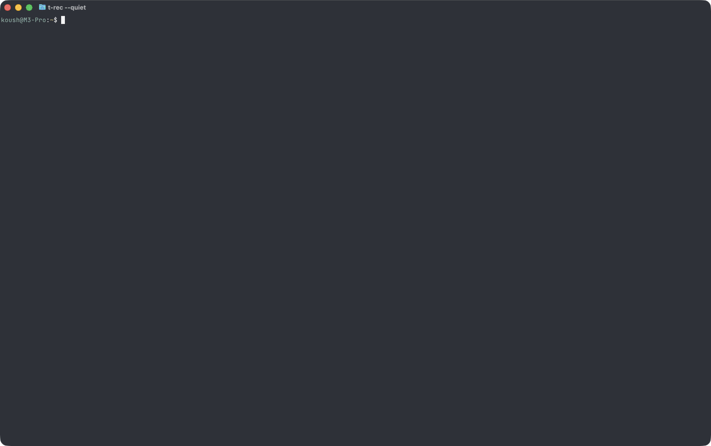

# SpaceTravLR (Rust 🦀️🚀️)

<!--  -->

[](https://github.com/Koushul/SpaceTravLR_rust/actions/workflows/release.yml)
[](https://github.com/Koushul/SpaceTravLR_rust/actions/workflows/rust.yml)

Rust implementation of [SpaceTravLR](https://github.com/jishnu-lab/SpaceTravLR) — spatial gene regulatory network inference and in-silico perturbation from Visium-style `.h5ad`.

```bash
curl -fsSL https://tinyurl.com/spacetravlr/scripts/install.sh | sh
```

For supported platforms, PATH setup, self-updates, and troubleshooting, see **[install.md](install.md)** (recommended over piping `curl` directly to `sh`: use `-o` then `sh` as shown there).



## Tech stack

- [ratatui](https://github.com/ratatui/ratatui) — training / perturbation TUIs
- [foyer](https://github.com/foyer-rs/foyer) — in-memory / disk cache (spatial viewer)
- [burn](https://github.com/tracel-ai/burn) — ML (CNN + backends)
- [tokio](https://github.com/tokio-rs/tokio) — async HTTP and pipelines
- [axum](https://github.com/tokio-rs/axum) — HTTP services (`spatial_viewer`, `umap_lab`)
- [polars](https://github.com/pola-rs/polars) — data processing
- [wgpu](https://github.com/gfx-rs/wgpu) — GPU compute where enabled
- [rayon](https://github.com/rayon-rs/rayon) — data parallelism

## Binaries and release artifacts

GitHub **release tarballs** ship **`spacetravlr`**, **`spacetravlr-perturb`**, and **`spatial_viewer`** (see [install.md](install.md)). Everything else is built from source with extra Cargo features or workspace crates.

| Binary | Purpose |
|--------|---------|
| **`spacetravlr`** | GRN training from spatial AnnData; TUI dashboard unless `--plain`; multi-host `--join-output-dir`; optional RCTD; subcommands below |
| **`spacetravlr-perturb`** | In-silico perturbation from a finished run (`spacetravlr_run_repro.toml` + `*_betadata.feather`); TUI or batch `--export` / `--batch-toml` |
| **`spatial_viewer`** | Local web UI + HTTP API over a run (feature **`spatial-viewer`**) |
| **`umap_lab`** | Standalone UMAP exploration server (feature **`umap-lab`**); not in release tarballs |
| **`spacetravlr-celloracle`** | CellOracle-style TF GRN helper in the **`celloracle/`** workspace member |
| **`spacetravlr-dev`** | Internal entry point (feature **`dev-main`**) |
| **`cnn_train_bench`** | Small CNN timing harness for development |

### `spacetravlr` subcommands

- **`run-summary`** — HTML run report without training (`spacetravlr run-summary --help`)
- **`collect-interactions`** — aggregate β from `*_betadata.feather` into a multi–cell-type interaction table (`--run-toml`, `--annot`, …)
- **`gui`** — runs `npm run build` under `web/umap_lab`, then starts the UMAP lab HTTP server (same UI family as the `umap_lab` binary)

Other notable flags on the main command (see **`spacetravlr --help`**): **`--peek`** / **`--peak`** for a compact `.h5ad` / 10x summary; **`--map-labels`** with **`--reference`** / **`--query`** for MALT label transfer (uses **`uv`** on `PATH`); RCTD flags when built with **`rctd`**.

Configuration defaults and overrides live in **`spaceship_config.toml`** (or **`--config`**). Training writes **`spacetravlr_run_repro.toml`** under the output directory for joins, the viewer, and perturbation.

## Cargo features (root `spacetravlr` crate)

| Feature | Effect |
|---------|--------|
| **`tui`** (default) | Full-screen training / perturb dashboards; `--plain` for line logs |
| **`self-update`** (default) | **`spacetravlr --update`** refreshes release binaries next to `spacetravlr` |
| **`rctd`** (default) | RCTD spatial deconvolution CLI (`--rctd`, …); use **`rctd-wgpu`** for the optional wgpu stack inside RCTD |
| **`spatial-viewer`** | Build the **`spatial_viewer`** binary |
| **`umap-lab`** | Build the **`umap_lab`** binary |

Lean install without the dashboard or self-update: **`cargo install --path . --locked --no-default-features`** (see [install.md](install.md)).

## Compute backend and environment variables

Training and related tools pick **WebGPU** (Burn / wgpu) when an adapter works; otherwise they use **CPU (NdArray)**.

| Variable | Meaning |
|----------|---------|
| **`SPACETRAVLR_FORCE_CPU=1`** | Force the CPU backend |
| **`SPACETRAVLR_DISABLE_WGPU=1`** | Skip GPU probing (stable on broken or headless Vulkan stacks) |

**GRN parquet files** (`mouse_network.parquet`, `human_network.parquet`): resolved from **`[grn].network_data_dir`** in config, then **`SPACETRAVLR_DATA_DIR`**, then `data/` next to the binary or repo-style search paths. Prebuilt binaries do not embed your dataset; copy **`data/`** from the repo or point **`SPACETRAVLR_DATA_DIR`** at a directory that contains those files.

More detail (benchmarks, parity notes, viewer API sketch): **[scripts/details.md](scripts/details.md)**.

## RCTD spatial deconvolution

The default **`spacetravlr`** feature set includes **`rctd`**. The Rust implementation is heavily optimized compared to the original R workflow. To build **without** RCTD, use **`--no-default-features`** and add back only the features you need.

If RCTD is omitted from your build, enable it with:

```bash
cargo build -p spacetravlr --features rctd
```

Example:

```bash
spacetravlr --rctd --h5ad spatial.h5ad --ref-adata reference.h5ad --rctd-output ./out/deconv
```

For RCTD’s optional wgpu path: **`--features rctd-wgpu`** (see root `Cargo.toml`).

## Workspace crates

Besides the **`spacetravlr`** library and binaries, this repo includes:

- **`celloracle/`** — `spacetravlr-celloracle` CLI
- **`crates/spacetravlr-rctd`** — RCTD integration
- **`crates/rctd-core`** — RCTD core logic
- **`crates/enrichr`** — Enrichr HTTP client crate

## UMAP lab (web UI)

The React app lives under **`web/umap_lab/`**. Production-style run (from repo root):

```bash
cd web/umap_lab && npm ci && npm run build
cargo build --features umap-lab --bin umap_lab
./target/debug/umap_lab --port 8765 --static-dir web/umap_lab/dist
```

See **`web/umap_lab/README.md`** for dev (Vite + API proxy). Alternatively, **`spacetravlr gui`** builds that bundle and starts the server without installing the separate `umap_lab` binary.
