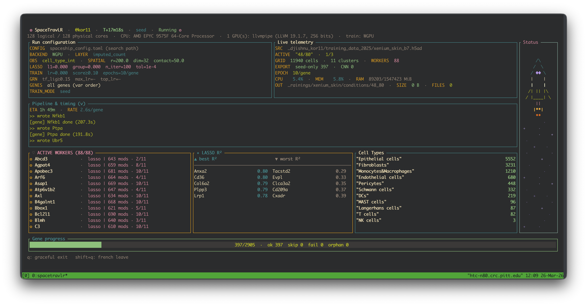

# SpaceTravLR (Rust 🦀️🚀️)

Rust implementation of [SpaceTravLR](https://github.com/jishnu-lab/SpaceTravLR)



## Installation

**Binary install (recommended for most users):** see **[install.md](install.md)** for supported platforms, PATH, and troubleshooting.

```bash
curl -fsSL https://tinyurl.com/spacetravlr/scripts/install.sh | sh
```
