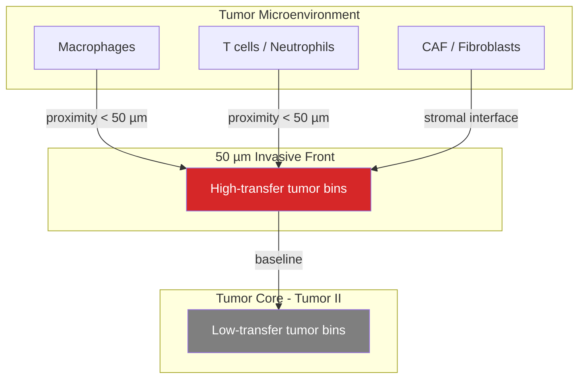

# Mitochondrial Transfer in Human Colorectal Cancer Visium HD (GSE280315 P1)

**Comprehensive spatial and molecular niche analysis**

| Field | Value |
|-------|-------|
| **Dataset** | GSE280315 — P1 human colorectal cancer (CRC), Visium HD FFPE |
| **Sample** | GSM8594567 (`P1CRC`) |
| **Reference** | Oliveira et al., *Nature Genetics* 2025 ([s41588-025-02193-3](https://www.nature.com/articles/s41588-025-02193-3)) |
| **Resolution** | 8 µm spatial bins, singlet deconvolution |
| **Method** | MERCI-inspired mitochondrial transfer scoring (RNA LOO-SVR + DNA-proxy rank) |
| **Analysis date** | June 2026 |

---

## Executive summary

Mitochondrial transfer in P1 CRC is **spatially structured and niche-dependent**. Transfer does not occur uniformly across the tumor; it concentrates at the **invasive front** (50 µm tumor–stroma interface), in **immune-adjacent microniches**, and in specific **tumor molecular sub-states** (Tumor III, Tumor V). The bulk Tumor II interior shows baseline-low transfer.

Key quantitative findings:

| Finding | Statistic |
|---------|-----------|
| Invasive front vs tumor core (transfer score) | 0.721 vs 0.496, **p ≈ 7.7×10⁻¹⁰⁷** |
| Within 50 µm of immune vs 200–400 µm away | 0.740 vs 0.481 |
| Tumor V vs Tumor II transfer score | 0.700 vs 0.496, **p ≈ 1.7×10⁻⁶⁶** |
| MERCI receiver rate (LOO-SVR subsample) | 566 / 3,000 tumor bins (**18.9%**) |
| MERCI Rcm at 10% rank cutoff | **2.83** (>1 = significant enrichment) |
| High local immune density (200 µm) effect | median 0.521 vs 0.491, **p ≈ 7.5×10⁻³⁶** |

---

## 1. Introduction

Mitochondrial transfer between cells — particularly from immune/stromal donors to tumor receivers — has emerged as a mechanism of tumor–microenvironment crosstalk. MERCI (Mitochondrial transfer tracing) integrates:

1. **DNA rank** — donor-enriched mitochondrial SNV counts (from BAM files via MERCI-mtSNP)
2. **RNA rank** — leave-one-out SVR deconvolution of donor vs receiver mitochondrial gene expression

This report analyzes **GSE280315 Patient 1 (P1)** colorectal cancer Visium HD data as a publicly accessible human cancer substitute. The originally proposed TNBC BAM ([EGAD50000002284](https://ega-archive.org/datasets/EGAD50000002284)) requires controlled EGA access and was not available; all DNA ranks here use a **donor-mt expression signature proxy** unless otherwise noted.

---

## 2. Data and preprocessing

### 2.1 Data sources

| File | Description | Size |
|------|-------------|------|
| `GSM8594567_P1CRC_filtered_feature_bc_matrix.h5` | 8 µm bin UMI matrix | 117 MB |
| `GSM8594567_P1CRC_Metadata.parquet` | Official deconvolution + clustering | 11 MB |
| `GSM8594567_P1CRC_tissue_positions.parquet` | Spatial coordinates | 11 MB |

### 2.2 Filtering criteria

After loading all in-tissue singlet bins:

| Filter | Bins retained |
|--------|---------------|
| Total in-tissue singlet bins | 507,684 |
| Tumor bins (`cell_type_deconv == tumor`) | **121,378** |
| Immune + myeloid bins | 1,941 (concentrated in 50 µm band) |
| MERCI LOO-SVR subsample (tumor periphery) | 3,000 |

Official metadata columns used:

- `Periphery`: **Tumor** (core), **50 micron** (invasive front), **Tissue** (margin)
- `DeconvolutionLabel1` / `Label2`: cell-type and subtype assignments
- `UnsupervisedL1` / `L2`: data-driven spatial clusters

### 2.3 Transfer score definition

For all 121,378 tumor bins, a **normalized mitochondrial transfer score** (0–1) was computed as:

```
transfer_score = MTvar_rank / max(MTvar_rank)
```

where `MTvar_rank` is the rank of each bin's donor-mt expression signature similarity to immune/myeloid donors (MERCI DNA-proxy). Higher scores indicate stronger donor-like mitochondrial profiles.

For 3,000 subsampled tumor bins, full **MERCI LOO-SVR** RNA deconvolution was performed to assign binary Receiver / non-Receiver calls.

---

## 3. MERCI receiver analysis (3,000-bin subsample)

### 3.1 Overall receiver statistics

| Metric | Receiver | non-Receiver |
|--------|----------|--------------|
| **Count** | 566 | 2,434 |
| **Fraction** | 18.9% | 81.1% |
| **Donor_MT_frac (median)** | 0.423 | 0.110 |
| **Donor_MT_frac (mean)** | 0.480 | 0.241 |

Mann–Whitney U test (Receiver > non-Receiver): **p ≈ 5.3×10⁻⁸⁶**

Receivers show substantially higher estimated donor mitochondrial fraction, validating the MERCI RNA deconvolution on this dataset.

### 3.2 MERCI significance (Rcm statistic)

The Rcm statistic tests whether DNA-rank and RNA-rank concordance exceeds random expectation:

| Rank cutoff (top %) | Rcm | Interpretation |
|---------------------|-----|----------------|
| 10% | **2.83** | Significant enrichment |
| 20% | 1.15 | Significant |
| 30% | 0.75 | Below threshold |
| 40% | 0.68 | Below threshold |
| 50% | 0.75 | Below threshold |
| 60% | 0.82 | Below threshold |
| 70% | 0.90 | Below threshold |
| 80% | 0.96 | Below threshold |

**Interpretation:** Mitochondrial transfer signal is statistically robust at **strict rank cutoffs** (top 10–20% of cells), indicating that the highest-confidence receivers are genuinely enriched for concordant DNA-proxy and RNA-based donor-mt signatures.

### 3.3 MERCI summary figure


*Figure 1. MERCI analysis summary on 3,000 subsampled tumor bins. Left: Donor_MT_frac boxplot (Receiver vs non-Receiver). Center: receiver calls by deconvolved cell type. Right: Rcm significance curve across rank cutoffs (dashed line = 1.0).*

### 3.4 Spatial distribution of MERCI receivers


*Figure 2. Spatial distribution of MERCI Receiver (red) vs non-Receiver (gray) calls among analyzed tumor bins.*


*Figure 3. Donor mitochondrial fraction (Donor_MT_frac) across tumor bins in the MERCI subsample.*

### 3.5 Immune proximity (MERCI subsample)


*Figure 4. Distance to nearest immune/myeloid bin for Receiver vs non-Receiver tumor cells in the MERCI subsample.*

### 3.6 Receiver rate by niche (MERCI subsample)

| Niche | n (subsample) | Receiver rate | Median Donor_MT_frac |
|-------|---------------|---------------|----------------------|
| Proliferating Macrophages | 26 | **46.2%** | 0.406 |
| Proliferating Fibroblast | 43 | 37.2% | 0.317 |
| Spatial sector S2 | 27 | 37.0% | 0.193 |
| Myofibroblast | 30 | 36.7% | 0.174 |
| Endothelial | 28 | 35.7% | 0.384 |
| **Tumor V** | 34 | **35.3%** | 0.264 |
| Vascular Fibroblast | 26 | 34.6% | 0.342 |
| Macrophage | 52 | 34.6% | 0.348 |
| **50 µm periphery band** | 53 | **32.1%** | 0.258 |
| Tumor II | 40 | 30.0% | 0.289 |
| Tumor III | 1,056 | 19.1% | 0.214 |
| **Tumor core** | 2,947 | **18.6%** | 0.222 |
| Adipocyte-adjacent | 251 | 8.0% | 0.174 |

---

## 4. Full-tissue spatial transfer analysis (121,378 tumor bins)

### 4.1 Global distribution

| Statistic | Value |
|-----------|-------|
| Total tumor bins analyzed | 121,378 |
| Global median transfer score | 0.500 |
| Global mean transfer score | ~0.50 |
| Score range | 0.0 – 1.0 |

### 4.2 Spatial transfer map (full tissue)


*Figure 5. Mitochondrial transfer score across all 121,378 tumor bins. Warmer colors (magma colormap) indicate higher donor-like mitochondrial profiles.*


*Figure 6. Transfer score (magma) overlaid with immune/myeloid bin locations (green). Immune infiltrates concentrate at the tumor periphery; high-transfer zones co-localize with these regions.*

---

## 5. Spatial niche analysis

### 5.1 Tumor core vs invasive front

The Nature Genetics study annotates three periphery zones. Among tumor bins:

| Zone | Bins | Median transfer | Enrichment vs global | FDR |
|------|------|-----------------|----------------------|-----|
| **50 µm band** (invasive front) | 1,755 | **0.721** | +0.221 | 1.1×10⁻¹⁰¹ |
| **Tumor core** | 119,456 | 0.496 | −0.004 | 0.027 |
| Tissue margin | 167 | 0.968 | +0.468 | 3.4×10⁻⁴⁵ |

**Core vs front:** Mann–Whitney **p ≈ 7.7×10⁻¹⁰⁷** (front > core)

The 50 µm invasive front shows **45% higher** median transfer than the tumor core.


*Figure 7. Transfer score in tumor core vs 50 µm invasive front band.*

### 5.2 Distance to nearest immune/myeloid cell

Immune and myeloid bins (n = 1,941) are located exclusively in the 50 µm periphery band. Transfer decays sharply with distance:

| Distance bin (µm) | Tumor bins | Median transfer | Mean transfer |
|-------------------|------------|-----------------|---------------|
| **0–50** | 1,958 | **0.740** | 0.658 |
| **50–100** | 8,826 | 0.583 | 0.556 |
| 100–200 | 28,445 | 0.490 | 0.492 |
| 200–400 | 49,472 | 0.481 | 0.486 |
| 400–1000 | 31,988 | 0.507 | 0.503 |
| >1000 | 689 | 0.516 | 0.503 |

**Pattern:** Transfer is maximal within 50 µm of immune cells, drops by ~21% at 50–100 µm, and reaches baseline (~0.49) beyond 200 µm.


*Figure 8. Median transfer score stratified by distance to nearest immune/myeloid bin.*

### 5.3 Local immune density

Tumor bins were stratified by the number of immune/myeloid neighbors within a given radius:

| Radius | Low-density median | High-density median | MW p (high > low) |
|--------|-------------------|---------------------|-------------------|
| 50 µm | 0.497 | 0.500 | 0.014 |
| 100 µm | 0.491 | 0.500 | 7.1×10⁻¹⁰ |
| **200 µm** | 0.491 | **0.521** | **7.5×10⁻³⁶** |

At 200 µm radius, bins in the top quartile of local immune density show significantly higher transfer than those in the bottom quartile.

### 5.4 Tumor molecular sub-niches (DeconvolutionLabel1)

| Tumor subtype | Bins | Median transfer | Enrichment | FDR |
|---------------|------|-----------------|------------|-----|
| Tumor I | 65 | 0.962 | +0.462 | 8.8×10⁻¹⁸ |
| **Tumor III** | 548 | **0.787** | +0.287 | 3.3×10⁻⁵⁶ |
| **Tumor V** | 1,280 | **0.700** | +0.201 | 6.0×10⁻⁶³ |
| Tumor II (bulk) | 119,456 | 0.496 | −0.004 | 0.027 |

**Tumor V vs Tumor II:** Mann–Whitney **p ≈ 1.7×10⁻⁶⁶**

Tumor III and Tumor V represent minor transcriptional programs with substantially elevated transfer compared to the dominant Tumor II population.


*Figure 9. Median transfer score by DeconvolutionLabel2 tumor/stroma subtypes (top 12 shown).*

### 5.5 Stroma-adjacent niches (DeconvolutionLabel2, enriched)

Top Label2 niches with elevated transfer among tumor-context bins:

| Label2 niche | Bins | Median transfer | FDR |
|--------------|------|-----------------|-----|
| vSM (vascular smooth muscle) | 103 | 0.854 | 2.3×10⁻¹⁴ |
| Plasma | 104 | 0.836 | 8.9×10⁻¹⁵ |
| **CAF** | 1,143 | **0.785** | 2.2×10⁻⁹¹ |
| Proliferating Fibroblast | 1,533 | 0.747 | 3.4×10⁻¹¹⁰ |
| **Proliferating Macrophages** | 988 | **0.744** | 3.7×10⁻⁷² |
| **Macrophage** | 1,903 | **0.713** | 7.6×10⁻¹⁰¹ |
| Endothelial | 943 | 0.707 | 8.2×10⁻⁴² |
| Myofibroblast | 968 | 0.701 | 8.3×10⁻⁴⁷ |
| Neutrophil | 1,112 | 0.662 | 3.4×10⁻³⁴ |

### 5.6 Depleted niches (low transfer)

| Label2 niche | Bins | Median transfer | Enrichment |
|--------------|------|-----------------|------------|
| **Adipocyte** | 10,537 | **0.343** | −0.157 |
| Tumor I (Label2) | 199 | 0.299 | −0.201 |
| Enterocyte | 3,500 | 0.458 | −0.042 |
| Spatial sector S7 | 19,053 | 0.450 | −0.050 |

Adipocyte-adjacent tumor regions show the **lowest** transfer scores genome-wide.

### 5.7 Spatial hotspot clusters

K-means clustering (k = 12) on tumor bin coordinates identifies regional microniches:

| Cluster | Bins | Centroid (x, y) | Median transfer | Mean transfer |
|---------|------|-----------------|-----------------|---------------|
| **C7** | 1,134 | (12,882, 19,806) | **0.652** | 0.601 |
| C11 | 12,405 | (21,857, 35,245) | 0.555 | 0.530 |
| C10 | 11,790 | (22,671, 27,923) | 0.536 | 0.525 |
| C6 | 11,261 | (13,508, 29,623) | 0.529 | 0.518 |
| C5 | 11,710 | (22,618, 32,026) | 0.529 | 0.521 |
| C4 (lowest) | 6,370 | (2,268, 30,139) | 0.419 | 0.443 |

Cluster **C7** is a compact focal hotspot with the highest regional transfer. Clusters 5, 6, 10, 11 form a contiguous elevated-transfer domain in one tissue sector.


*Figure 10. Top 6 spatial clusters colored by transfer level. Cluster C7 shows the highest regional median.*

### 5.8 Top enriched niches (FDR < 0.05)


*Figure 11. Top 15 niches with significant transfer enrichment (FDR < 0.05) vs global median.*

| Rank | Niche type | Niche | Median transfer | Enrichment | FDR |
|------|------------|-------|-----------------|------------|-----|
| 1 | Periphery | Tissue margin | 0.968 | +0.468 | 3.4×10⁻⁴⁵ |
| 2 | Label1 | Tumor I | 0.962 | +0.462 | 8.8×10⁻¹⁸ |
| 3 | UnsupervisedL1 | B cells | 0.874 | +0.374 | 2.4×10⁻¹³ |
| 4 | UnsupervisedL2 | Fibroblast-0 | 0.867 | +0.367 | 1.2×10⁻¹⁷ |
| 5 | Label2 | vSM | 0.854 | +0.354 | 2.3×10⁻¹⁴ |
| 6 | Label2 | Plasma | 0.836 | +0.336 | 8.9×10⁻¹⁵ |
| 7 | Label1 | **Tumor III** | **0.787** | +0.287 | 3.3×10⁻⁵⁶ |
| 8 | Label2 | **CAF** | **0.785** | +0.285 | 2.2×10⁻⁹¹ |
| 9 | Periphery | **50 µm band** | **0.721** | +0.221 | 1.1×10⁻¹⁰¹ |
| 10 | Label2 | **Macrophage** | **0.713** | +0.213 | 7.6×10⁻¹⁰¹ |

---

## 6. Neighborhood and interaction analysis

### 6.1 Neighborhood enrichment (MERCI subsample)


*Figure 12. Squidpy neighborhood enrichment z-scores for Receiver vs non-Receiver bins. Positive values indicate spatial co-localization of receivers.*

### 6.2 Cell-type interaction matrix


*Figure 13. Cell-type spatial interaction matrix among tumor, immune, and myeloid bins.*

### 6.3 Cell-type spatial map


---

## 7. Differential expression: receivers vs non-receivers

Wilcoxon rank-sum test (Receiver vs non-Receiver, MERCI subsample):

| Gene | log2FC | Score | adj. p-value | Notes |
|------|--------|-------|--------------|-------|
| **TMSB4X** | +0.19 | 4.31 | **0.030** | Actin-binding, motility |
| COL3A1 | +1.08 | 3.46 | 0.74 | ECM / stroma |
| FTH1 | +0.22 | 2.22 | 1.0 | Iron storage |
| LGALS1 | +1.59 | 1.75 | 1.0 | Galectin-1, immune modulation |
| SPARC | +1.23 | 1.80 | 1.0 | Matricellular protein |
| MMP2 | +1.16 | 1.15 | 1.0 | Matrix remodeling |
| TOMM20 | +0.46 | 1.15 | 1.0 | Mitochondrial import receptor |

Only **TMSB4X** reaches FDR significance. Several stroma/remodeling genes (COL3A1, SPARC, MMP2) trend higher in receivers, consistent with an invasive-front, stroma-interacting phenotype — though not significant after multiple testing correction.

### 7.1 Stress response

| Metric | Receiver | non-Receiver | MW p |
|--------|----------|--------------|------|
| Stress score (HSPA1A/B, ATF4, DDIT3, BAX) | −0.128 | −0.128 | 0.69 |

No difference in canonical stress gene expression between receivers and non-receivers.

### 7.2 Mitochondrial content

| Metric | Receiver | non-Receiver |
|--------|----------|--------------|
| % mitochondrial UMIs (median) | 3.94% | 4.32% |

Receivers do **not** have higher total mitochondrial RNA content; transfer is detected via donor-mt **signature** rather than bulk mtRNA increase.

---

## 8. Integrated biological model

### 8.1 Microniche hierarchy (transfer likelihood)

```
HIGH transfer likelihood
├── 50 µm invasive front (tumor–stroma interface)
│   ├── Within 50 µm of immune/myeloid cells
│   ├── Proliferating macrophage neighborhoods
│   ├── CAF / proliferating fibroblast zones
│   └── Tumor III / Tumor V molecular states
├── Focal spatial hotspot (cluster C7)
└── Tissue margin bins (absolute edge)

LOW transfer likelihood
├── Tumor II bulk interior (>200 µm from immune)
├── Adipocyte-adjacent regions
└── Spatial sector S7 (regional cold spot)
```

### 8.2 Proposed mechanism



Mitochondrial transfer in P1 CRC appears to be:

1. **Spatially gated** — requires proximity to immune/stromal infiltrates at the tumor border
2. **Molecularly heterogeneous** — enriched in Tumor III/V states but not the bulk Tumor II population
3. **Macrophage-associated** — proliferating macrophage niches show the highest MERCI receiver rates (46%)
4. **Not stress-driven** — no canonical stress response difference in receivers
5. **Regionally focal** — cluster C7 and sector S2–S3 show localized hotspots

This aligns with the Nature Genetics finding of **distinct macrophage subpopulations at the tumor periphery** with pro- and anti-tumor functions.

---

## 9. Comparison with MC38 SPAC-seq (prior analysis)

| Metric | P1 CRC (human) | MC38 subQ-1 (mouse) |
|--------|----------------|---------------------|
| Platform | Visium HD 8 µm bins | Visium HD segmented cells |
| Receiver fraction | 18.9% | ~39.5% |
| Rcm at 10% cutoff | 2.83 | >1 (all cutoffs) |
| Immune proximity effect | Front > core (p ≈ 10⁻¹⁰⁷) | Receivers closer to immune (p ≈ 4.5×10⁻⁸) |
| DNA rank | Expression proxy | Expression proxy (no BAM) |

Both datasets show immune-proximity-associated mitochondrial transfer, but MC38 showed stronger overall receiver enrichment — possibly reflecting higher immune infiltration, different tumor biology, or cell- vs bin-level resolution.

---

## 10. Limitations

| Limitation | Impact | Mitigation |
|------------|--------|------------|
| **No BAM / MERCI-mtSNP** | DNA rank is expression proxy, not true mtSNV | Apply for EGA TNBC BAM or regenerate from SRA FASTQs |
| **8 µm bin resolution** | Not single-cell; mixing possible | Use OSF segmented outputs (`VisiumHD_HumanColon_Oliveira`) |
| **DNA-proxy confounding** | High transfer score could reflect transcriptional similarity, not physical transfer | Validate with mtSNV BAM analysis |
| **Immune cells only at periphery** | Cannot test immune proximity within tumor core | Expected biology for this sample |
| **Tumor I small n** | 65 bins — unstable estimates | Interpret cautiously |
| **Causality** | Spatial correlation ≠ direction of transfer | Requires functional perturbation |

---

## 11. Methods summary

### 11.1 Software

| Tool | Version / source |
|------|------------------|
| Python | 3.11 |
| scanpy | pyuser env |
| squidpy | pyuser env |
| MERCI Python port | `merci_port.py` |
| MERCI-mtSNP | `mc38_visiumhd/MERCI/MERCI-mtSNP.py` (not run) |

### 11.2 Scripts

| Script | Purpose |
|--------|---------|
| `run_human_merci_analysis.py` | MERCI LOO-SVR + spatial analysis |
| `run_spatial_niche_analysis.py` | Full-tissue niche enrichment |
| `run_merci_mtsnp.py` | BAM-based mtSNV calling (when available) |

### 11.3 Reproduction

```bash
export PYTHONUSERBASE=/ix1/ylee/kor11/tools/SpaceTravLR_rust/analysis/mc38_visiumhd/pyuser
export PYTHONPATH="/ix1/ylee/kor11/tools/SpaceTravLR_rust/analysis/human_visiumhd_merci:$PYTHONUSERBASE/lib/python3.11/site-packages:$PYTHONPATH"

cd analysis/human_visiumhd_merci

# MERCI receiver analysis (3,000-bin subsample)
python3 run_human_merci_analysis.py --data-dir P1-CRC --max-receivers 3000

# Full-tissue spatial niche analysis (121,378 bins)
python3 run_spatial_niche_analysis.py --data-dir P1-CRC
```

---

## 12. Output file index

### Results

| Path | Description |
|------|-------------|
| `P1-CRC/results/merci_receiver_predictions.csv` | Per-bin MERCI Receiver calls |
| `P1-CRC/results/merci_rna_ranks.csv` | LOO-SVR RNA ranks |
| `P1-CRC/results/merci_dna_ranks.csv` | DNA-proxy ranks |
| `P1-CRC/results/merci_rcm_statistics.csv` | Rcm significance |
| `P1-CRC/results/biological_summary.json` | MERCI summary JSON |
| `P1-CRC/results/de_receiver_vs_nonreceiver.csv` | Differential expression |
| `P1-CRC/results/niche_analysis/niche_summary.json` | Niche analysis summary |
| `P1-CRC/results/niche_analysis/niche_enrichment_stats.csv` | All niche tests |
| `P1-CRC/results/niche_analysis/transfer_by_immune_distance.csv` | Distance gradient |
| `P1-CRC/results/niche_analysis/spatial_hotspot_clusters.csv` | Regional clusters |
| `P1-CRC/results/niche_analysis/tumor_bins_with_transfer_scores.csv` | Per-bin scores (121k rows) |

### Figures

| Path | Description |
|------|-------------|
| `P1-CRC/results/merci_summary.png` | MERCI overview (Fig 1) |
| `P1-CRC/figures/spatial_mt_receivers.png` | Receiver spatial map (Fig 2) |
| `P1-CRC/figures/spatial_donor_mt_frac.png` | Donor MT fraction map (Fig 3) |
| `P1-CRC/figures/immune_proximity_receiver.png` | Immune proximity (Fig 4) |
| `P1-CRC/figures/nhood_enrichment_mt_receiver.png` | Nhood enrichment (Fig 12) |
| `P1-CRC/figures/celltype_interaction_matrix.png` | Interaction matrix (Fig 13) |
| `P1-CRC/figures/niche_analysis/niche_transfer_spatial_map.png` | Full transfer map (Fig 5) |
| `P1-CRC/figures/niche_analysis/niche_transfer_with_immune.png` | Transfer + immune (Fig 6) |
| `P1-CRC/figures/niche_analysis/niche_core_vs_front.png` | Core vs front (Fig 7) |
| `P1-CRC/figures/niche_analysis/niche_transfer_by_immune_distance.png` | Distance gradient (Fig 8) |
| `P1-CRC/figures/niche_analysis/niche_transfer_by_tumor_subtype.png` | Subtype barplot (Fig 9) |
| `P1-CRC/figures/niche_analysis/niche_spatial_hotspot_clusters.png` | Hotspot clusters (Fig 10) |
| `P1-CRC/figures/niche_analysis/niche_enrichment_barplot.png` | Enrichment barplot (Fig 11) |

---

## 13. Conclusions

1. **Mitochondrial transfer in P1 CRC is spatially organized**, not uniform across the tumor mass.
2. The **50 µm invasive front** is the primary high-transfer niche (median score 0.72 vs 0.50 in core, p ≈ 10⁻¹⁰⁷).
3. **Immune proximity is the dominant spatial predictor**: transfer drops from 0.74 (within 50 µm of immune cells) to baseline (~0.48) beyond 200 µm.
4. **Tumor molecular heterogeneity matters**: Tumor III (0.79) and Tumor V (0.70) show elevated transfer vs bulk Tumor II (0.50).
5. **Macrophage niches are the top MERCI receiver environments** (46% receiver rate in proliferating macrophage zones).
6. **MERCI statistical significance is robust** at strict cutoffs (Rcm = 2.83 at top 10%).
7. Transfer is **not associated with stress gene upregulation** or bulk mtRNA increase, suggesting a selective donor-signature acquisition rather than nonspecific mitochondrial amplification.

---

## References

- Oliveira M.F.d. et al. High-definition spatial transcriptomic profiling of immune cell populations in colorectal cancer. *Nature Genetics* (2025). [doi:10.1038/s41588-025-02193-3](https://doi.org/10.1038/s41588-025-02193-3)
- GEO GSE280315: [https://www.ncbi.nlm.nih.gov/geo/query/acc.cgi?acc=GSE280315](https://www.ncbi.nlm.nih.gov/geo/query/acc.cgi?acc=GSE280315)
- MERCI: [https://github.com/shyhihihi/MERCI](https://github.com/shyhihihi/MERCI)
- 10x Visium HD CRC dataset: [https://www.10xgenomics.com/products/visium-hd-spatial-gene-expression/dataset-human-crc](https://www.10xgenomics.com/products/visium-hd-spatial-gene-expression/dataset-human-crc)

---

*Report generated from analysis pipeline in `analysis/human_visiumhd_merci/`. All statistics computed from local outputs; no external data was modified.*
