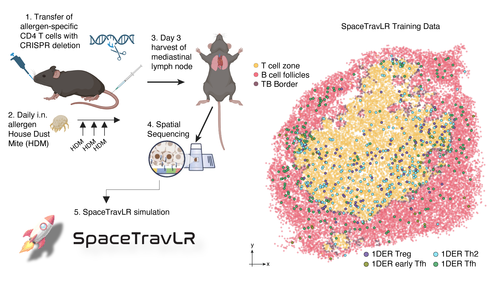
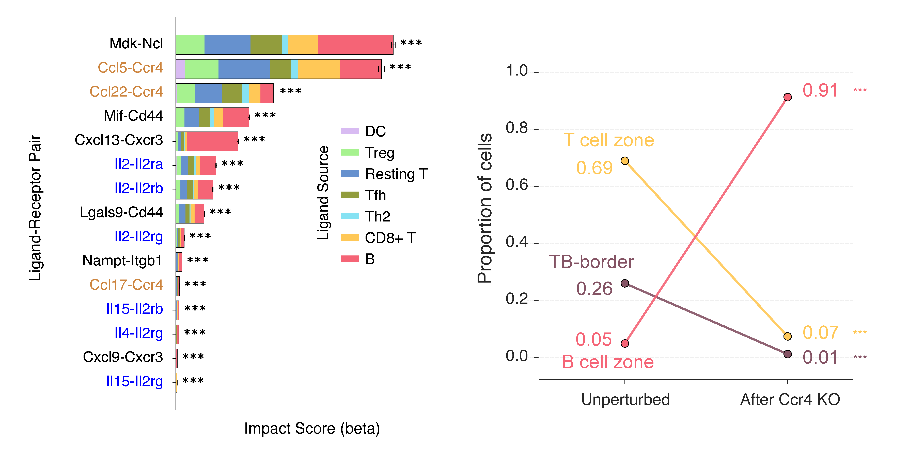
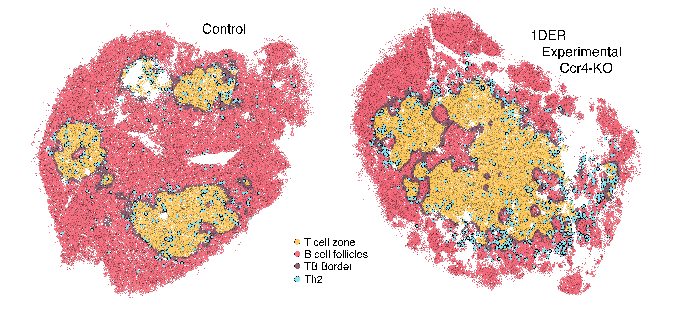
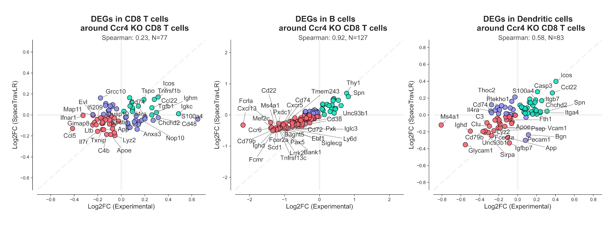

Finally, we aimed to use SpaceTravLR to understand spatial cell dynamics in a setting where we could experimentally validate results. We focused on a murine model of allergic asthma to elucidate the functional roles of key molecules in determining spatial migration patterns of T cell subsets. 

Here we applied SpaceTravLR to recapitulate this mechanism de-novo as well as find novel molecules underlying the spatial migration of these pathogenic cells. We specifically analyzed a Slide-seqV2 dataset with paired TCR-seq collected from the medLN three days after adoptive transfer of HDM-specific TCR transgenic CD4 T cells followed by intranasal administration of HDM daily for three days. Spatial mapping in the medLN revealed anatomical organization of T cell zones, B cell follicles, and TB borders, providing the necessary framework for interpreting localizations of 1DER CD4 T cell subsets. 

Using SpaceTravLR, we sought to identify the strongest spatially dependent ligand-receptor interactions that controlled Th2 identity. Consistent with earlier findings, we recapitulated the importance of IL-2 axis in allergen-specific Th2 cell differentiation while also identifying Ccr4-dependent ligand interactions involving Ccl17, Ccl22, and Ccl573,74. Interestingly, the distribution of the top interaction scores for these ligands and receptors also exhibited distinct spatial patterns, with Th2 cells closer to the central tissue region showing the highest scores. Specifically, the highest scoring interaction was for Ccr4-Ccl5 in Th2 cells that were localized in the central medLN region, which mirrored the spatial gradient that transitioned from T cell zone to B cell follicles.

Across both Slide-seqV2 and VisiumHD datasets, our model predicted that Ccr4 deletion would cause antigen-specific Th2 cells in the T cell zone to become transcriptionally more similar to cells at the TB border and B cell follicles (Figs. 6F, 6G). While Ccr4 is known to promote migration of Th2 cells to the lung, the impact of Ccr4 deletion on its localization in the lymph node had not been described. SpaceTravLR’s simulated knockout demonstrates high concordance with the observed experimental effect on the Th2 cells across the three zones.

For each Ccr4 KO Th2 cell, we assigned the zone of its nearest neighbor (T cell zone, B cell follicle, or T–B border). We compared these assignments to a null built by Monte Carlo permutation: 1,000 times we drew a random set of *N* cells (*N* = number of Th2 cells), took each cell’s nearest neighbor, and recorded zone proportions. Control vs. KO comparisons were normalized for baseline zone abundance in each tissue. Positive log₂ fold change means KO Th2 cells shifted toward that zone; negative means away; near zero means no change relative to control.

