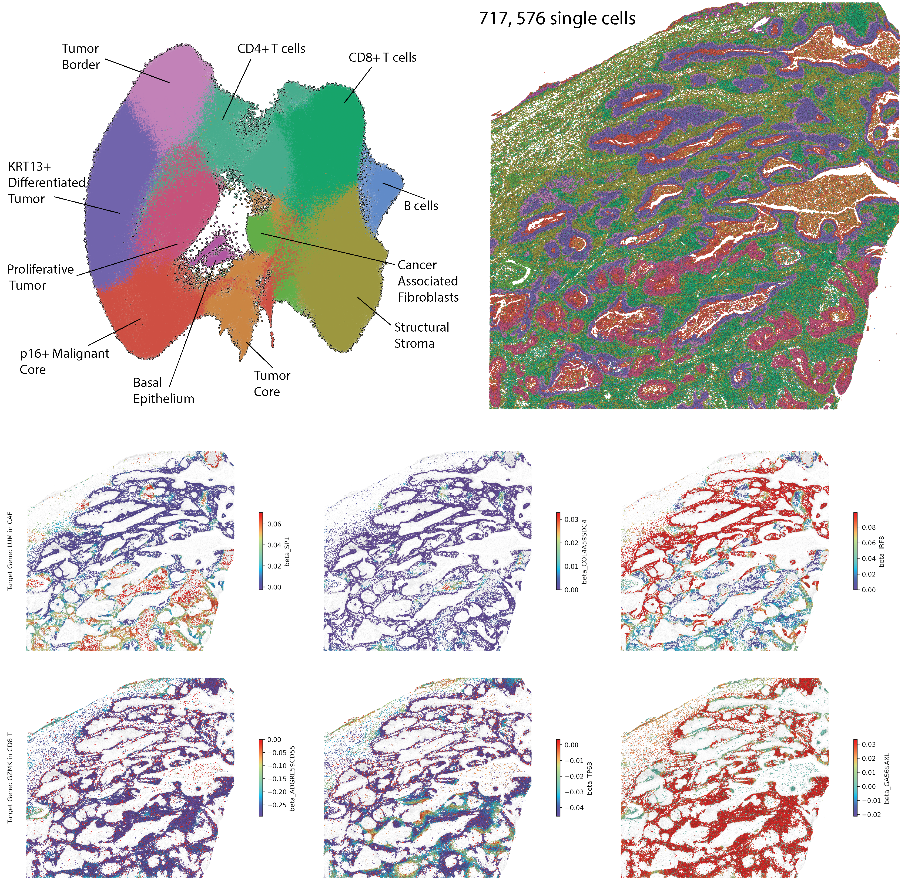

# Cervical cancer (human, Atera)

Human FFPE cervical cancer data showcases results using the pre-commercial version of the Atera Whole Transcriptome Assay (WTA), which is currently under development. The assay was designed to closely match the Chromium Flex Apex assay in terms of content and sensitivity, and includes 18,028 genes. 

The number of probes per gene were optimized to maximize sensitivity of lowly expressed genes and avoid optical crowding risk for highly expressed genes. 

The 10x Genomics in situ multimodal cell segmentation solution was used to generate cell segmentation boundaries.

[Source](https://www.10xgenomics.com/datasets/atera-wta-ffpe-human-cervical-cancer)

