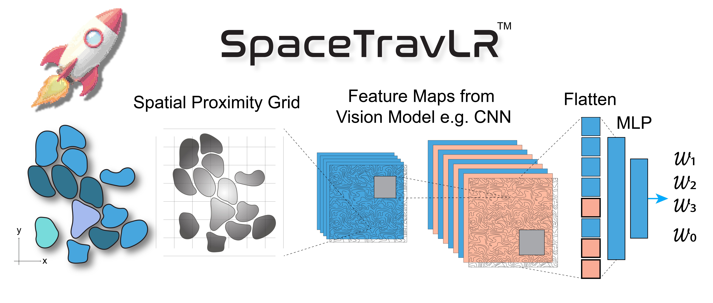
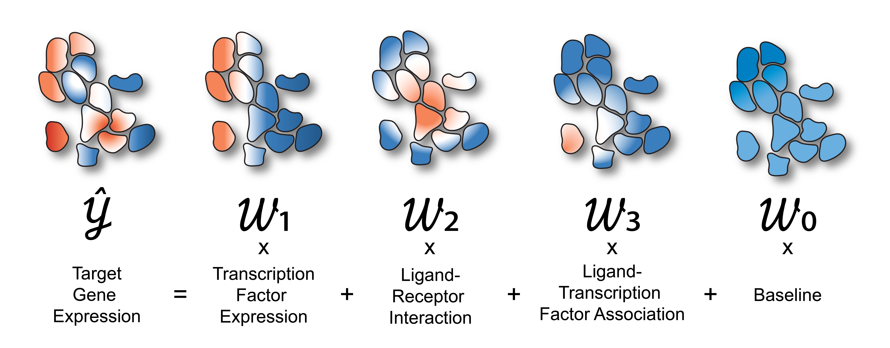

<!-- # <span style="font-size:2em;">SpaceTravLR</span> {: .st-brand } -->


SpaceTravLR infers how single or combinatorial genetic perturbations rewire signals across the tissue neighbourhood, by propagating effects through underlying spatially resolved molecular networks, thereby modelling how perturbations can reshape both the targeted cell and its surroundings.


# I want to 🧞️

<div id="st-i-want-to" class="st-i-want-to" markdown="0"></div>



## Quickstart
#### Install me
```bash
curl -fsSL https://tinyurl.com/spacetravlr/scripts/install.sh | sh
```
#### Run me
```bash
spacetravlr --h5ad /path/to/adata.h5ad --output-dir /path/to/outputdir
```

#### Join me
```bash
spacetravlr --join-output-dir  /path/to/outputdir --plain
```
For example, this slurm job will coordinate multiple workers on the same output/adata
```
#!/bin/bash
#SBATCH --partition=preempt
#SBATCH --job-name=SpaceTravLR
#SBATCH --mem=300G
#SBATCH --output=/dev/null
#SBATCH --error=/dev/null
#SBATCH --nodes=1
#SBATCH --ntasks=1
#SBATCH --cpus-per-task=64
#SBATCH --cluster=gpu
#SBATCH --gres=gpu:1
#SBATCH --time=1-00:00:00

spacetravlr --join-output-dir /path/to/outputdir --plain
```

#### Analyze me
```bash
spacetravlr collect-interactions \
  --run-toml /path/to/outputdir/spacetravlr_run_repro.toml 
```

<!-- Learn more about [how SpaceTravLR works](math.md), other [installations](install.md) details and CLI [usage](usage.md). -->

#### Point an AI agent at me

SpaceTravLR publishes an [`llms.txt`](llms.txt) index and a self-contained [`llms-full.txt`](llms-full.txt) reference following the [llmstxt.org](https://llmstxt.org/) convention. Give either URL to Claude, Cursor, ChatGPT, or any coding agent and it will know the full capability surface, every CLI flag, the config schema, and the output formats.

```
https://spacetravlr-rust.readthedocs.io/en/latest/llms-full.txt
```


## Training time estimate {#training-time-estimate}

The widget below provides a rough estimate of how long training SpaceTravLR on your dataset will take. This was empirically estimated using multiple runs across datasets on a100, l40s and rtx6k GPUs.

<div id="st-runtime-estimator" class="st-runtime-estimator" markdown="0"></div>

\(s_{\mathrm{gpu}}\) is a GPU model specific coefficient representing the speedup relative to only using the CPU.

`cnn_max_cells` allows the CNN to smartly subsample the dataset as the training converges. Higher values means later epochs see fewer and fewer cells, focusing on tissue region where the residual errors are higher.