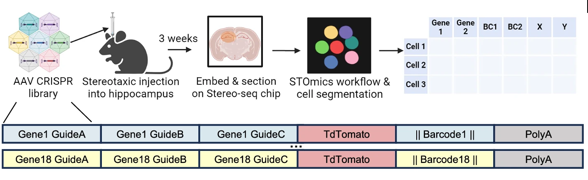

To validate SpaceTravLR, we use publicly available data from a recently developed spatial in vivo CRISPR platform that interrogates multiple genes within single cells of intact tissues. Spatial Perturb-Seq simultaneously measures whole transcriptomes at single-cell resolution (and therefore cell type), CRISPR barcodes (linked to gene perturbation), spatial coordinates, and cell-cell interactions (microenvironment)

[Shen et al. (2026) Spatial perturb-seq: single-cell functional genomics within intact tissue architecture](https://www.nature.com/articles/s41467-026-69677-6)

  <a href="/assets/stereoseq.png" target="_blank" style="font-size:1.05em;">
    &#x26F6;
  </a>

Differential gene expression analysis comparing SpaceTravLR’s prediction and the experimental spatial perturb-seq data was done using Scanpy’s `rank_genes_groups` function using the Wilcoxon rank-sum test. Genes with adjusted p-value < 0.05 and log2fc > 0.5 were marked as differentially expressed. 

To compare the simulated KO with the experimental data, we select the 30 nearest neighbors of each perturbed cell and perform DGE.

