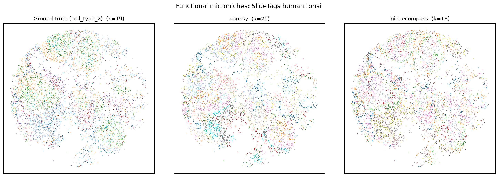
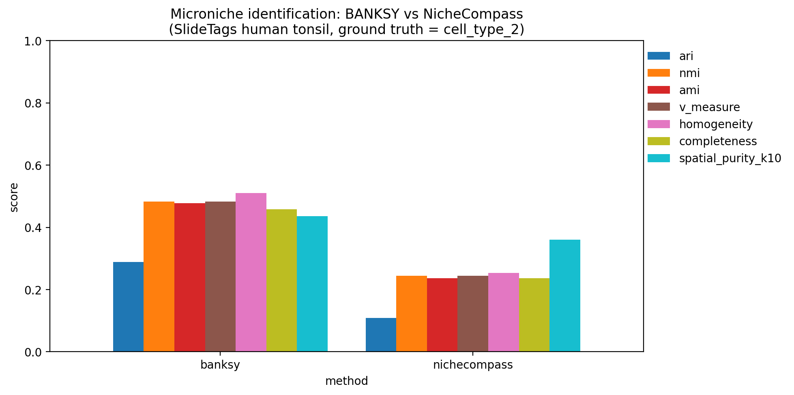

# NicheCompass vs BANKSY: functional microniche benchmark

End-to-end benchmark comparing two methods for identifying *functional
microniches* from spatial transcriptomics:

- **BANKSY** (Singhal *et al.*, *Nat. Genet.* 2024) — neighbourhood-augmented
  PCA + Leiden clustering, distributed as
  [`pybanksy`](https://pypi.org/project/pybanksy/).
- **NicheCompass** (Birk *et al.*, *Nat. Genet.* 2025) — interpretable
  graph variational auto-encoder over prior ligand–receptor / ligand–target
  gene programs, distributed as
  [`nichecompass`](https://pypi.org/project/nichecompass/).

## Dataset and ground truth

[`data/h5ad/SlideTags_human_tonsil.h5ad`](../../data/h5ad/SlideTags_human_tonsil.h5ad)
(5 778 cells × 3 333 genes; Russell *et al.*, *Nature* 2024) is used because its
`obs['cell_type_2']` annotation is a fine-grained map of the *functional
microniches* of a secondary lymphoid follicle:

| GT label                 | Microniche / function |
|--------------------------|-----------------------|
| GC Light Zone            | Centrocytes selected by FDC + Tfh |
| GC Dark Zone             | Proliferating centroblasts |
| GC Intermediate Zone     | Light/dark-zone transition |
| FDC                      | Follicular dendritic-cell scaffold |
| T_follicular_helper      | Tfh inside germinal center |
| Treg / NKT / Th1 / Th2 / T memory / Naive CD4 T / T_CD8 | T-cell zone microniches |
| B_naive                  | Mantle zone B cells |
| B_memory                 | Memory B cells |
| plasma                   | Plasma-cell foci |
| mDC, pDC, myeloid        | Myeloid microniches |

After light QC (`min_counts=200`, `min_genes/cell=50`, `min_cells/gene=5`)
the benchmark uses **5 646 cells × 3 333 genes** with **19 ground-truth
microniches** stored in `obs['microniche_gt']`.

## Layout

```
experiments/niche_benchmark/
├── README.md              # this file
├── .gitignore             # excludes .venv, h5ad, mlruns
├── src/
│   ├── _common.py         # shared loader / QC / save helpers
│   ├── prepare_dataset.py # produces results/tonsil_prepared.h5ad
│   ├── run_banksy.py      # runs pyBanksy and writes labels/banksy.csv
│   ├── run_nichecompass.py# trains NicheCompass and writes labels/nichecompass.csv
│   ├── evaluate.py        # writes results/metrics.csv
│   └── plot_results.py    # writes figures/*.png
├── labels/                # per-method CSV (cell_id,label) + .json metadata
├── results/               # metrics.csv + intermediate latent + log
└── figures/               # spatial maps + metric bar chart
```

## Reproducing

```bash
cd experiments/niche_benchmark
uv venv --python 3.11 .venv
source .venv/bin/activate
uv pip install "torch==2.4.1" --index-url https://download.pytorch.org/whl/cpu
uv pip install "numpy<2" scanpy anndata scikit-learn matplotlib seaborn pandas \
                scipy umap-learn leidenalg python-igraph h5py pyarrow squidpy
uv pip install pybanksy
uv pip install torch_scatter torch_sparse \
    -f https://data.pyg.org/whl/torch-2.4.1+cpu.html
uv pip install torch_geometric "decoupler<2" mlflow omnipath pyreadr nichecompass

python src/prepare_dataset.py
python src/run_banksy.py
BENCH_TORCH_THREADS=32 python src/run_nichecompass.py
python src/evaluate.py
python src/plot_results.py
```

The pipeline runs end-to-end on CPU (no GPU required).
NicheCompass is the bottleneck (≈7 min on 32 CPU threads, AMD EPYC 9575F).

## Method configuration

### BANKSY (`run_banksy.py`)
- HVG: top 2 000 by Seurat flavour, z-scaled.
- Spatial graph: 15 nearest neighbours, scaled-Gaussian decay (`max_m=1`).
- Sweep: λ ∈ {0.2, 0.5, 0.8} × Leiden res ∈ {0.5, 1.0, 1.5, 2.0} on PC₂₀.
- Pure non-spatial Leiden (λ = 0) is excluded so the benchmark reflects
  the actual BANKSY contribution.
- Final run is the parameter set whose cluster count is closest to GT
  (19) — chosen unsupervised, no peeking at metrics. Lock-in: λ = 0.5,
  res = 2.0 → 20 clusters.

### NicheCompass (`run_nichecompass.py`)
- HVG: top 2 000.
- Spatial graph: `squidpy.gr.spatial_neighbors`, k = 8.
- Prior gene programs: built **from this repo's
  [`data/human_network.parquet`](../../data/human_network.parquet)** so the
  benchmark is reproducible offline. Two sources are merged:
  - `lr` edges (ligand → receptor): one GP per ligand.
  - `nichenet` edges (ligand → target gene): top-50 targets per ligand.
  After de-duplication and gene-availability filtering 95 prior GPs survive
  (+ 16 add-on GPs).
- Encoder: 1 GCN layer, 64 hidden units; 30 epochs (5 GP-warm-up).
- Latent dim = #active GPs + 16 add-on (31 here).
- Clustering: Leiden over the latent representation, sweep
  res ∈ {0.3, 0.5, 0.7, 1.0, 1.3, 1.6, 2.0}; lock-in run by closest-to-GT
  cluster count (res = 0.7 → 18 clusters).

### Evaluation (`evaluate.py`)
For each method we report:

- **ARI / NMI / AMI / FMI** vs `microniche_gt` (sklearn).
- **Homogeneity / completeness / V-measure** (sklearn).
- **Spatial purity (k = 10):** fraction of each cell's 10 spatial neighbours
  sharing its predicted label, averaged over cells. Higher = niches are
  spatially contiguous; the GT itself is a useful baseline.

## Results

`results/metrics.csv`

| method        | k_pred | ARI    | NMI    | AMI    | V-measure | Homo.  | Comp.  | spatial purity (k=10) | runtime (s) |
|---------------|--------|--------|--------|--------|-----------|--------|--------|-----------------------|-------------|
| ground_truth  | 19     | 1.000  | 1.000  | 1.000  | 1.000     | 1.000  | 1.000  | **0.277**             | —           |
| BANKSY        | 20     | **0.289** | **0.483** | **0.477** | **0.483** | **0.511** | **0.458** | **0.435**           | 26.6        |
| NicheCompass  | 18     | 0.108  | 0.245  | 0.237  | 0.245     | 0.253  | 0.236  | 0.360                 | 408.4       |





### Take-aways

- **BANKSY wins on every clustering-vs-ground-truth metric** (≈ 2.5–2.7×
  higher ARI / NMI / V-measure). For Slide-tags tonsil at this depth, the
  neighbourhood-augmented expression representation tracks `cell_type_2`
  better than NicheCompass's GP-constrained latent.
- **Both methods produce more spatially contiguous labels than the cell-type
  GT itself** (0.43 / 0.36 vs 0.28). NicheCompass tends toward broader,
  smoother niches (visible in `figures/spatial_microniches.png`); BANKSY
  produces tighter, more cell-type-faithful clusters.
- **BANKSY is ~15× faster** here (27 s vs 408 s on 32 CPU threads).
  Per-method costs are dominated by Leiden in BANKSY and the variational
  GAE training loop in NicheCompass.
- Caveats: NicheCompass is designed primarily for *interpretable*
  niche–program inference and benefits from richer prior GPs (full
  OmniPath + NicheNet + CollecTRI + MeBoCost + cell-type masks); the
  parquet-based GP set used here for offline reproducibility is leaner
  than the published benchmarks. Spatial sample size (5.6k cells) is
  also at the low end for the GAE.

## Notes on installation

`pybanksy` and `nichecompass` are both pip-installable. The PyG C-extensions
(`torch_sparse`, `torch_scatter`) require the matching wheel index:
`https://data.pyg.org/whl/torch-2.4.1+cpu.html`. `numpy<2` is pinned for
PyTorch 2.4.1 wheel compatibility.
